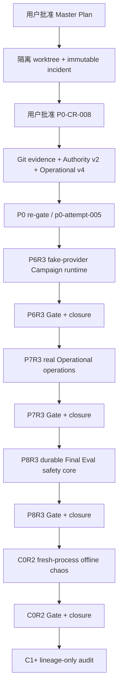
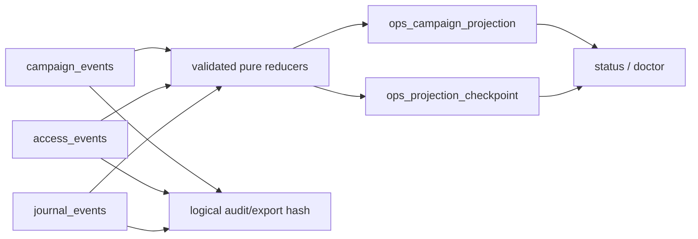
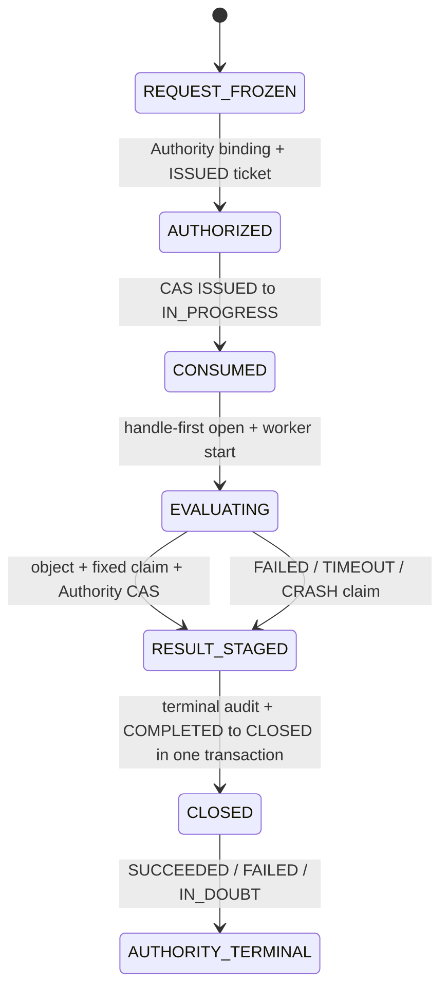

# V3.4.2 Corrective Recovery Implementation Plan

> **For agentic workers:** REQUIRED SUB-SKILL: Use superpowers:subagent-driven-development (recommended) or superpowers:executing-plans to implement this plan task-by-task. Steps use checkbox (`- [ ]`) syntax for tracking.

**Goal:** 在不覆盖历史证据、不开放真实 Campaign/LLM/Final Holdout 的前提下，修复 2026-08-10 工作中的 P6、P7、P8 与后续 C0 缺口，并用可重复验证的 committed-Git 证据重新建立可信 Gate lineage。

**Architecture:** 先建立一个不可变的跨阶段incident，再通过单一`P0-CR-008`一次性修正committed evidence/activation coordinator、Authority Final Eval uniqueness/recovery和OperationalJournal v4/access integrity三个sealed-TCB边界。完成P0 re-gate后，按P6→P7→P8→C0串行关闭Gate；各阶段采用新attempt、single-process JIT Authority activation、生产路径上的fixture验证和create-only证据，不改写任何旧receipt、Gate、closure或数据库行。

**Tech Stack:** Python 3、`unittest`、SQLite/WAL、现有 control-plane Authority/Operational stores、Git committed blobs、Windows handle APIs、PowerShell 验证命令。

---

## 0. 文档状态、批准方式与硬边界

- Plan ID：`V342-CORRECTIVE-20260811-R1`
- 状态：`DRAFT / FOR USER REVIEW / IMPLEMENTATION NOT AUTHORIZED`
- 设计基线：[2026-08-10 DeepSeek 接手内容审查报告](../reviews/2026-08-11-deepseek-aug10-review-draft.md)
- DeepSeek 执行附件：[V3.4.2 DeepSeek Execution Handoff](2026-08-11-v342-deepseek-execution-handoff.md)（ID `V342-DEEPSEEK-HANDOFF-20260811-R1`）；该附件只规定启动、续接和报告方式，不新增授权或改变本计划范围。
- 审查基线提交：`122d30378bcdb64e8145eb608306ad128945cdf8..11a3e4a9f92dd76d8f564aae7b8d06e6645b66f5`
- 当前规划快照：分支 `codex/v342-control-plane`，HEAD `aceaec87f6d416a7a924ba0fbf51f84e39938d6a`。
- 如果实施开始前 HEAD 不再是该提交，第一步必须审查新增 delta 并更新 baseline；不得静默沿用过期计划。
- 本计划只描述实现方法，不包含实现代码。本轮不得开始任何实现、迁移、Gate、外部 review 或 Campaign。
- 用户认可审查报告不等于批准本计划，也不等于批准 `P0-CR-008`、数据库迁移、外部模型审阅或任一 phase implementation。

建议的分层批准语句：

1. `APPROVE_PLAN id=V342-CORRECTIVE-20260811-R1`
2. 阅读正式 change request 后单独发送 `APPROVE_CHANGE_REQUEST id=P0-CR-008`
3. 迁移前单独发送 `AUTHORIZE_STORE_MIGRATION id=P0-CR-008 targets=authority,operational`
4. 每个原子task candidate从隔离worktree进入主工作树前，单独批准`ACTIVATE_CANDIDATE phase=<phase> task=<task-id> source_commit=<sha> envelope_commit=<sha> manifest_sha256=<sha256>`。由于每个task结束后会产生新的official TaskReport/evidence commit并成为下一candidate的base，本计划不允许预批未来batch；不得使用commit range、branch tip或通配范围代替逐项hash。
5. P0 新 closure 完成后，分别批准 P6、P7、P8 和 C0；任何阶段不得自动进入下一阶段。
6. 如需真实独立模型审阅，单独批准 reviewer、provider/model 与允许披露的材料范围。

所有阶段授权 receipt 必须显式保持以下值：

- `real_campaign_authorized=false`
- `real_llm_campaign_authorized=false`
- `final_holdout_authorized=false`
- `real_data_or_kbase_mutation_authorized=false`
- `scheduler_or_acl_mutation_authorized=false`
- `production_promotion_authorized=false`
- `c1_c2_c3_authorized=false`
- `auto_advance=false`

本计划不授权停止、终止、暂停或更改用户已启动的任何长任务。若 migration 发现活跃 lease、运行中 cycle 或打开的数据库句柄，迁移必须停止并等待任务自然结束或用户另行指示。

## 1. 固定标识与唯一执行顺序

| 对象 | 固定标识 |
|---|---|
| Evidence incident | `CP-20260811-P6P8-001` |
| P0 change request | `P0-CR-008` |
| P0 corrective attempt | `p0-attempt-005` |
| P6 corrective attempt | `p6-attempt-003` / `P6R3` |
| P7 corrective attempt | `p7-attempt-002` / `P7R3` |
| P8 corrective attempt | `p8-attempt-002` / `P8R3` |
| C0 corrective attempt | `c0-attempt-002` / `C0R2` |
| C1+ lineage audit task | `c1-lineage-audit-001`（不是 rollout attempt） |
| C1 后续候选 | `c1-attempt-002`，只有专项审计和新授权后才可创建 |

`P0-CR-008` 是当前仓库中 `P0-CR-001..007` 之后的下一个可用编号。实施第一步必须再次执行编号冲突检查；若届时已存在 `P0-CR-008`，立即停止并修订本计划，不得自动改号或覆盖。



风险严重度最高的是 P8；施工依赖顺序仍固定为 P0 → P6 → P7 → P8 → C0。P7/P8 测试夹具和文档可以在文件不重叠时并行准备，但后继 attempt 的 Authority activation、Gate build 与 closure 必须等待前驱的新 committed closure。

### 1.1 已冻结优先级

| 优先级 | 工作 | 原因 | 是否阻断后继 |
|---|---|---|---|
| P0-A | incident、旧 lineage quarantine、`P0-CR-008` 范围批准 | 先固定事实和授权边界，避免修复过程继续污染历史 | 是 |
| P0-B | committed-Git evidence/activation coordinator、Authority v2、Operational v4、live migration、P0 re-gate | 是后续所有ticket、Gate、P7/P8 durable semantics的可信根 | 是 |
| P0-C | P6R3 | 当前没有真正可执行的受控 Campaign 路径，且已有明确回归 | 是，P7/P8 依赖它 |
| P0-D | P7R3 | 真实状态会被显示为绿色零值，属于 fail-open 运维风险 | 是，P8/C0 依赖它 |
| P0-E | P8R3 | 风险严重度最高：Final Holdout 是不可逆安全边界；但必须在 P0/P6/P7 后实施 | 是，C0 依赖它 |
| P1-A | C0R2 | 用 fresh-process chaos 证明修复后的整条离线路径，不开放真实 provider/Holdout | 是，C1+ lineage 审计依赖它 |
| P1-B | C1+ lineage-only audit | 决定哪些下游结果必须重跑；本计划不执行真实 LLM rerun | 否，不阻断 P0–C0 修复完成 |
| P2 | 文档一致性与 nonblocking cleanup | 不影响安全、正确性或 Gate 可信度 | 否 |

优先级和执行顺序不是同一个概念：P8 的单项风险最高，但在 Authority v2、P6 lifecycle 和 P7 durable read model 之前直接施工会再次形成不可验证的孤立实现，因此不得抢跑。

## 2. 范围、非目标与完成定义

### 2.1 本计划包含

- 前向记录旧 P6/P7/P8/C0 Gate 与 closure 的争议状态；旧字节和 Authority 行保持不变。
- 一次 P0 sealed-TCB 变更：committed Git blob evidence、Authority Final Eval uniqueness/recovery/result-claim APIs、OperationalJournal v4/WAL/derived tables/access-event integrity anchor。
- P6 可执行的 fake/injected-provider Campaign runtime 和唯一受控 CLI 入口。
- P7 针对真实 `campaign_events`、`access_events`、`journal_events` 的状态、诊断、审计、导出、投影、备份恢复、持久 backfill/retention 和性能门。
- P8 durable consume-once、真实 Authority lease、handle-first 数据边界、可恢复 saga、terminal audit 和 `CampaignStatus.CLOSED`。
- C0 真正的 fresh-process crash/replay、durable pause/resume、network deny、严格 invariant 与原子 create-only publication。
- C1 及以后 lineage 专项审计；只决定是否需要重跑，不执行真实 LLM rerun。

### 2.2 本计划不包含

- 真实 LLM/provider 调用、真实 Campaign、C1/C2/C3 rollout。
- 真实 Final Holdout 的打开、读取、hash、迁移或评估。
- A 股数据、KBase、策略参数、生产选股逻辑、scheduler、ACL 或 promotion 的变更。
- 对 `set_param`、reset、rollback 或参数恢复逻辑的修改。
- 停止用户运行中的回测、预计算、sweep、Campaign 或其他长任务。
- 清理当前工作树的大量未跟踪文件或修改用户的 `CHANGELOG.md`、`daily_run.py`、`daily_select.py`、`docs/b1_v3_results.md`。
- 为了通过 Gate 而缩小测试范围、改日期/样本/阈值、减少 reviewer、使用 CPU/单模型等降级路径。

### 2.3 Findings 到工作包的覆盖

| 审查 finding | 修复工作包 | 重新接受标准 |
|---|---|---|
| F1 P8 非持久化一次性评估 | P0-Authority、P8R3 T1–T8 | 跨 grant 的 plan+holdout 唯一性、真实 lease、一次打开、异常 closure、CLOSED |
| F2 P7 真实状态显示假零值 | P0-Operational、P7R3 T1–T9 | 缺失/损坏/schema/gap 全部 exit 4；真实事件投影全部状态面 |
| F3 P6 无可执行路径和 6 个回归 | P6R3 T1–T7 | 7/7 routing 回归通过；受控 fake Campaign 可执行；旧 shell 路径仍 fail-closed |
| F4 Gate 未证明完整回归 | Verification Runtime + 每阶段 cumulative Gate | 同一完整环境 full discovery exit 0，真实 `tests_run` 与完整日志 hash 入 receipt |
| F5 独立审阅不可证明 | Review protocol | 不同实现 invocation、真实 reviewer metadata、raw output hash、conflict disclosure |
| F6 hash/引用/closure 不可变性缺陷 | Incident、P0 Git evidence、统一 Gate 流程 | committed LF blob 是唯一文件 hash；Gate 先提交后 close；closure 只前向补充 |
| F7 阶段授权文本不一致 | 每阶段 phase-specific activation | 真实 Authority grant/ticket；无 `documentary_only` 冒充；`auto_advance=false` |

## 3. 核心实现思路

### 3.1 P6：薄 runtime，复用现有 controller

`campaign_runtime.py` 只负责装配和执行现有 `OperationalCampaignController` 的公开步骤，不重写 7,000+ 行 controller。唯一 shell 命令是 `run_research.py campaign`；它只有在可信调用方通过 `main(..., campaign_context=...)` 注入内存 capability 时才可执行。argv 和环境变量都不能携带 Authority secret、provider URL、API key、nonce 或 store root。

旧 `brainstorm/discover/resume-discover/full-cycle/review/chat/roundtable/interactive/repair-handoff-runner` 不重新开放：它们保持 `BLOCKED_PENDING_C1_ADAPTER`。原 6 个 routing 测试只验证命令内部参数路由，并在单元测试层隔离 Campaign boundary；新的端到端 guard 测试证明真实未授权 CLI 仍在构造 Orchestrator/provider 前退出 3。

### 3.2 P7：事件仍是事实源，projection 永远不能授权

Operational v4 在同一 SQLite 文件中增加四类可删除重建的派生表：`ops_projection_checkpoint`、`ops_campaign_projection`、`ops_backfill_checkpoint`、`ops_retention_metadata`，并增加一个不可被普通rebuild覆盖的`ops_access_event_integrity` sidecar chain。`campaign_events`、`access_events`、`journal_events`仍是业务事实源；projection只加速read model，不能反向签发ticket、启动cycle或批准publication。由于现有`access_events`行没有覆盖sequence/occurred_at的envelope hash，v3→v4迁移必须在quiescent snapshot中为全部历史行建立canonical row hash+prefix chain，把root写入migration receipt/metadata；迁移后每个access append与新anchor row在同一transaction提交。reader不能在发现anchor缺失/不匹配时“重新计算并接受”。



真实 CLI 默认只读固定仓库 store。missing、corrupt、future/wrong schema、sequence gap、checkpoint ahead、prefix mismatch、unknown required event 或 multiple-active-campaign 都返回稳定 JSON error 和退出码 4，绝不返回绿色零值。P7 Gate 前如要启用真实 store，必须另获迁移授权；没有迁移授权时 P7 保持 `IMPLEMENTED_NOT_ACTIVATED`，不能关闭 Gate。

### 3.3 P8：Authority CAS 是不可逆消费点，Operational transaction 是关闭点

Authority v2 新增 `final_eval_authorizations_v1`，以 root-secret 域分离 HMAC 后的 nonce fingerprint 保存身份；明文 nonce 不进入 request、DB、outbox、日志或 evidence。表中把 Authority grant 的 `authority_plan_hash` 与 `FinalEvalRequestV2` 中由 committed canonical research-plan manifest 得到的 `research_plan_sha256` 分开保存；全局唯一约束覆盖 nonce fingerprint、`(research_plan_sha256, holdout_id)`、`(research_plan_sha256, holdout_sha256)`、request hash、ticket和fixed result claim。它同时持久化safe saga state/version、result object ref/hash、fixed claim ref/hash和terminal binding，不存result bytes/metrics/labels/path secret，从而让新进程能够定位已stage结果但不能重新评估。

P0-CR-008 同时定义窄的 Final Eval recovery surface：`AuthorityReader` 可以按安全状态扫描/读取 `IN_PROGRESS`、`IN_DOUBT`、`RESULT_STAGED` bindings；受信reconciler必须先用新的maintenance/recovery TaskTicket取得`FinalEvalRecoveryLease`。该lease由root Authority在新进程中JIT签发，不重建原`TaskExecutionLease` bearer secret，只允许读取binding、验证result claim、补terminal/CLOSED和Authority terminal/outbox；它的side-effect set永远不含`OPEN_HOLDOUT`、provider invoke、evaluate、reset或reissue。没有这个独立recovery capability时，P8不得实现或声明fresh-process recovery。



`ISSUED → IN_PROGRESS` 和 `TASK_STARTED` outbox 在同一 Authority transaction 内完成；transaction commit之前不得构建holdout handle。worker结果先写同卷content-addressed object，再exclusive-create每ticket唯一fixed claim，最后用Authority CAS把claim ref/hash绑定为`RESULT_STAGED`；不同object竞争同一claim必须冲突失败。terminal audit和`COMPLETED → CLOSED`在同一Operational transaction内完成。跨库崩溃由持有独立`FinalEvalRecoveryLease`的durable saga reconciler处理：允许从fixed claim补closure、补Authority terminal/outbox或标记`IN_DOUBT`，永远不允许重新打开holdout、返回`ISSUED`或再次计算。

P8 wire contract统一升为V2：`FinalEvalRequestV2`只携带nonce fingerprint和committed identities，`HoldoutConsumedV2`绑定真实ticket/consume CAS/result-claim状态，`HoldoutHandleV2`只封装已验证OS handle与真实lease lineage。现有V1 DTO/JSON只允许历史证据只读解析，不能进入production assembly、P8 Gate或被静默升级；V1/V2混用必须fail-closed。

### 3.4 C0：supervisor/worker/verifier 三进程证明

C0 supervisor 先持久化 deterministic schedule；worker 每次只执行一个 bounded step，并用真实进程退出注入 crash；恢复 worker 使用不同 PID/start identity，只从 SQLite、ledger 和 schedule 重建状态；第三个只读 verifier 计算 completed cycles、exact invariant set 和 digest。两次同 seed replay 使用不同 temp roots、新进程且无 cache。

网络 guard 必须在 worker 导入 provider/campaign 模块前安装，并拒绝 DNS、socket connect/connect_ex/create_connection 和真实 provider adapter。报告通过 create-only、flush/fsync、exclusive publication 写入 `c0-attempt-002`；相同字节幂等，不同字节或并发冲突 fail-closed。

### 3.5 Activation coordinator：单进程持有 capability，源码激活与 schema migration 分票

普通分步shell命令不能安全传递`TaskExecutionLease`：bearer secret不能写入argv/env/disk，而新进程也不能从DB hash重建。因此P0新增`activation_coordinator.py`，由一个长驻父进程完成“读取committed envelope→live Authority issue/begin→持有内存lease→以argv vector执行exact fast-forward→验证HEAD/tree/quarantine→启动clean-worktree test children→记录receipts→finish→outbox”。子进程永远不接收lease secret；父进程退出即丢失capability，ticket留在`IN_PROGRESS`并由独立Authority reconciliation标`IN_DOUBT`，不能恢复原lease或自动重试branch mutation。

首次P0存在不可避免的bootstrap边界：coordinator源码尚未进入official branch。唯一允许的例外是，从locked Git object读取已经过独立review、并在`ACTIVATE_CANDIDATE phase=P0 task=P0-SOURCE-BOOTSTRAP ... bootstrap_blob_sha256=<sha256>`中单独批准的coordinator regular blob；当前v1 Python父进程在执行前核对blob/mode/hash，只让它调用现有v1 Authority ticket API和exact Git activation，不允许migration/raw SQL/network/store copy。该父进程必须在v1 schema下finish source-activation ticket并drain outbox后退出。P0源码成为official后，后续统一从主工作树import coordinator；live Authority/Operational migration使用第二张独立migration ticket，不让一个lease跨source reload或v1→v2 schema边界。

bootstrap/coordinator的崩溃语义固定：begin前失败零Authority/branch变化；begin后/fast-forward前失败为IN_DOUBT且branch不变；fast-forward后/finish前失败为IN_DOUBT且branch保持新HEAD，必须走forward-fix，禁止reset；finish后/outbox前失败只允许幂等mirror/ack。任何无法证明单进程持有、blob精确批准或v1 ticket在migration前已terminal的情况都阻断P0。

## 4. 文件职责与所有权地图

以下是计划允许触碰的源码/测试面。每个 TaskSpec 必须进一步收窄 allowed files；表中出现不代表任一 task 可同时修改全部文件。

| 阶段 | 文件 | 动作 | 单一职责 |
|---|---|---|---|
| Docs/P0 | `docs/superpowers/plans/2026-08-11-v342-corrective-recovery-plan.md` | 当前新建 | 唯一 Master Plan |
| Docs/P0 | `docs/superpowers/plans/2026-08-11-v342-p0-change-request-008.md` | 新建 | 冻结三类 sealed-TCB delta、迁移与 re-gate 范围 |
| P0 | `research_automation/control_plane/git_evidence.py` | 新建 | 从锁定 Git runtime 读取 committed regular blobs、mode/OID/bytes/hash |
| P0 | `research_automation/control_plane/inventory.py` | 修改 | 将 inventory/freeze 与 committed-blob identity 对齐 |
| P0 | `research_automation/control_plane/gates.py` | 修改 | Gate build/verify 只接受 committed evidence；保持 GateReport V1 |
| P0 | `research_automation/control_plane/cli.py` | 修改 | Gate CLI 的 committed evidence 与稳定退出码 |
| P0 | `research_automation/control_plane/sqlite_uow.py` | 修改 | store-specific durability policy、同一事务 schema/read validation |
| P0 | `research_automation/control_plane/stores.py` | 修改 | Authority v2 uniqueness/recovery/result-claim、Operational v4/access integrity、显式 v1/v3 migrations |
| P0 | `research_automation/control_plane/access.py` | 修改 | 新access append与sealed integrity sidecar同transaction提交 |
| P0 | `research_automation/control_plane/store_migration.py` | 新建 | quiescence、SQLite backups、staging rehearsal、live migration coordinator |
| P0 | `research_automation/control_plane/activation_coordinator.py` | 新建 | 单进程JIT ticket/lease、exact fast-forward、test child与terminal/outbox编排 |
| P0 tests | `tests/test_control_plane_git_evidence.py` | 新建 | autocrlf、blob mode、dirty/uncommitted、post-commit verification |
| P0 tests | `tests/test_control_plane_git_source_identity.py` | 修改 | source/inventory ancestry 与 suffix 规则 |
| P0 tests | `tests/test_control_plane_gates.py` | 修改 | committed evidence Gate build/verify/close |
| P0 tests | `tests/test_control_plane_sqlite_uow.py` | 修改 | WAL/NORMAL/timeout/read transaction policy |
| P0 tests | `tests/test_control_plane_stores.py` | 修改 | Authority v1→v2、Operational v3→v4、rollback/identity/outbox |
| P0 tests | `tests/test_control_plane_campaign_store.py` | 修改 | v4 compatibility、access integrity append、P8 terminal transaction |
| P0 tests | `tests/test_control_plane_access.py` | 修改 | access canonical row chain、atomic append、tamper detection |
| P0 tests | `tests/test_control_plane_store_migration.py` | 新建 | backup/quiescence/staging/live publish/rollback boundary |
| P0 tests | `tests/test_control_plane_activation_coordinator.py` | 新建 | v1 bootstrap、no-secret handoff、crash matrix、exact activation、v2 normal path |
| Verification | `requirements/verification-runtime.in` | 条件新建 | full-discovery 单一环境的直接依赖输入 |
| Verification | `requirements/verification-runtime.lock` | 条件新建 | 可重现的完整验证依赖锁 |
| P6 | `research_automation/control_plane/campaign_runtime.py` | 新建 | `CampaignCommandContext` 与唯一 authorized runtime 编排 |
| P6 | `research_automation/control_plane/campaign_offline_provider.py` | 新建 | production-owned deterministic fake provider/fault schedule |
| P6 | `research_automation/control_plane/campaign_adapters.py` | 修改 | 注入式 AG2、OpenAI-compatible、CLI provider seams |
| P6 | `research_automation/control_plane/campaign_preflight.py` | 修改 | 正式 legacy disposition 和 Campaign context 检查 |
| P6 | `research_automation/control_plane/campaign_invocation_binding.py` | 修改 | 三类 seam 的 frozen identity/bounds 验证 |
| P6 | `research_automation/control_plane/cli_registry.py` | 修改 | 注册唯一 programmatic-context `campaign` command/effect |
| P6 | `run_research.py` | 修改 | 新 `campaign` 命令与内存 context；修复 list/export 分工 |
| P6 | `run_research_cycle.py` | 修改 | 只保留迁移提示和 fail-closed，不再构造 legacy runner |
| P6 tests | `tests/test_control_plane_campaign_runtime.py` | 新建 | runtime 顺序、replay、observer、safe result、CLI e2e |
| P6 tests | `tests/test_control_plane_campaign_offline_provider.py` | 新建 | fake identity、usage、fault determinism、zero network |
| P6 tests | `tests/helpers/control_plane_campaign_runtime_child.py` | 新建 | fresh-process fixture child，仅测试使用 |
| P6 tests | `tests/test_control_plane_campaign_adapters.py` | 修改 | 三 provider seam 合同 |
| P6 tests | `tests/test_control_plane_campaign_invocation_binding.py` | 修改 | construction-before-binding 和 identity drift |
| P6 tests | `tests/test_control_plane_campaign_preflight.py` | 修改 | legacy/context disposition |
| P6 tests | `tests/test_ag2_cli_routing.py` | 修改 | 隔离 boundary 后只验证旧 handler 参数路由 |
| P6 tests | `tests/test_cli_entry_guards.py` | 修改 | 真实未授权 shell 继续在构造前退出 3 |
| P6 tests | `tests/test_control_plane_campaign_two_cycle.py` | 修改 | 不再依赖脆弱 private fixture；fresh-process two-cycle proof |
| P7 | `research_automation/control_plane/operations_projection.py` | 新建 | 真实三事件流 reader、pure reducers、checkpoint/rebuild |
| P7 | `research_automation/control_plane/operations_recovery.py` | 新建 | backup、staging restore、完整性验证和 rollback |
| P7 | `research_automation/control_plane/operations_maintenance.py` | 新建 | runtime health observer、持久 backfill、retention、disk guard |
| P7 | `research_automation/control_plane/operations.py` | 修改 | 兼容 façade；真实 CLI 转发到生产模块，synthetic helper 隔离 |
| P7 | `research_automation/control_plane/memory.py` | 修改 | retention metadata 与 context reference 更新，不执行年龄删除 |
| P7 tests | `tests/test_control_plane_operations_runtime.py` | 新建 | 真实 schema/read model/status/doctor/audit/export |
| P7 tests | `tests/test_control_plane_operations_recovery.py` | 新建 | WAL backup、staging restore、corruption/rollback |
| P7 tests | `tests/test_control_plane_operations_maintenance.py` | 新建 | durable backfill/retention/disk/observer |
| P7 tests | `tests/test_control_plane_operations_performance.py` | 新建 | 真实 append/projection/context/import/backup/overhead benchmark |
| P7 tests | `tests/test_control_plane_operations.py` | 修改 | 保留可复用 fixture 合同，停止把 synthetic 结果当生产证明 |
| P7 tests | `tests/test_control_plane_memory.py` | 修改 | retention reference update与SCIENTIFIC preservation |
| P7 tests | `tests/test_control_plane_ops_cli.py` | 修改 | 四 CLI 端到端 exit code、零逻辑DB写入、无 runner/holdout import |
| P8 | `research_automation/control_plane/final_eval_authority.py` | 新建 | V2 request、Authority ticket/consume CAS与no-open recovery capability |
| P8 | `research_automation/control_plane/final_eval_data.py` | 新建 | opaque root capability、handle-first open、low-privilege backend |
| P8 | `research_automation/control_plane/final_eval_closure.py` | 新建 | terminal audit、CLOSED transition、幂等与冲突拒绝 |
| P8 | `research_automation/control_plane/final_eval_saga.py` | 新建 | durable state replay、异常映射、reconciler |
| P8 | `research_automation/control_plane/final_eval_runtime.py` | 新建 | 唯一非测试装配入口；只接受内存 capability |
| P8 | `research_automation/final_eval_worker.py` | 新建 | 固定 handle-only、strict-JSON 低权限子进程协议 |
| P8 | `research_automation/control_plane/final_evaluator.py` | 修改 | 保留 domain/bounds；移除 caller outcome/fake lease；兼容 re-export |
| P8 | `research_automation/control_plane/campaign_store.py` | 修改 | transaction 内 event append 与 P8 lease-bound writer |
| P8 | `research_automation/control_plane/campaign_lifecycle.py` | 修改 | `CampaignStatus.CLOSED` 和唯一 `COMPLETED → CLOSED` |
| P8 | `research_automation/control_plane/campaign_controller.py` | 修改 | 所有新 cycle/execute/resume 入口拒绝 CLOSED |
| P8 | `research_automation/control_plane/entry_policy.json` | 修改 | 只允许受控 FinalEvalRuntime 拥有 `OPEN_HOLDOUT` |
| P8 tests | `tests/test_control_plane_final_eval_authority.py` | 新建 | global uniqueness、nonce secrecy、CAS/outbox |
| P8 tests | `tests/test_control_plane_final_eval_data.py` | 新建 | reparse/TOCTOU/ADS/device/hardlink/handle-only worker |
| P8 tests | `tests/test_control_plane_final_eval_closure.py` | 新建 | atomic terminal+CLOSED、并发与 replay |
| P8 tests | `tests/test_control_plane_final_eval_saga.py` | 新建 | crash matrix、recovery、no reopen |
| P8 tests | `tests/test_control_plane_final_eval_runtime.py` | 新建 | 唯一装配、entry policy、普通 runner denial |
| P8 tests | `tests/test_control_plane_final_evaluator.py` | 修改 | 保留纯合同；反转 different-nonce test；内存实现降级为 fixture |
| C0 | `research_automation/control_plane/rollout_chaos_fixtures.py` | 新建 | production-owned offline fake provider/clock/PID/protocol/store fixtures |
| C0 | `research_automation/control_plane/rollout_chaos_worker.py` | 新建 | 单 bounded step、crash、recover、verify worker 协议 |
| C0 | `research_automation/control_plane/rollout_chaos.py` | 修改 | supervisor、durable schedule、exact invariants、V2 report |
| C0 | `research_automation/control_plane/cli_registry.py` | 修改 | C0 official publication要求programmatic Authority context |
| C0 tests | `tests/test_control_plane_rollout_chaos_fixtures.py` | 新建 | 无 `tests.*` production import、temp containment、fake-only |
| C0 tests | `tests/test_control_plane_rollout_chaos_worker.py` | 新建 | process identity、crash/recovery、pause/network guard |
| C0 tests | `tests/test_control_plane_rollout_chaos_publication.py` | 新建 | create-only/idempotent/concurrent publication |
| C0 tests | `tests/test_control_plane_rollout_chaos.py` | 修改 | 24 cycles、no-cache replay、exact category/invariant set |

明确不计划修改`entry_guard.py`的legacy ticket实现；P8的唯一Authority源是`stores.py`中的sealed store。正常消费只接受`TaskExecutionLease`，崩溃收尾只接受由新maintenance ticket派生、无`OPEN_HOLDOUT`权限的`FinalEvalRecoveryLease`。不为P7或P8新增第三个数据库。

## 5. 所有阶段共用的执行协议

### 5.1 隔离、分支和用户文件保护

- 实施使用 `superpowers:using-git-worktrees`，路径固定为 `.claude/worktrees/v342-corrective-recovery`，分支固定为 `codex/v342-corrective-recovery`。
- worktree 从实施时重新确认的 HEAD 创建；不得从 `11a3e4a` 回退，也不得在当前脏工作树直接开发。
- 创建 worktree 前确认 `.claude/worktrees/` 仍被 `.gitignore` 忽略。
- 保存四个受保护 tracked 文件的状态摘要，并生成当前全部 tracked-dirty/untracked 路径的 `preexisting_user_delta_quarantine`；所有 task 激活前后逐项比对。
- 不使用 `git reset --hard`、checkout cleanup、rebase、recursive delete、stash 用户修改或 broad staging。
- 每次只用精确 `git add -- <task-owned-paths>`；TaskSpec 之外的 delta 使该 task FAIL。

源码准备和 official Authority/Gate 使用两个明确上下文：

- 隔离 worktree 是 clean scratch/candidate preparation 环境，只做源码/测试改动、fixture RED/GREEN、静态检查和 read-only candidate review。它不读取、复制、symlink/junction、重新 provision 或迁移主工作树的 live Authority/Operational stores。
- 隔离 worktree 中的 commit 在激活前统一标记 `NON_AUTHORITATIVE_PREPARATION`：它证明候选 bytes 和候选测试结果，但不能充当 official TaskTicket、trusted receipt、live migration receipt、Gate、closure 或 phase predecessor。
- 主工作树是唯一 official repository root。live Authority/Operational、JIT TaskTicket、lease begin/finish、outbox、live CLI smoke、inventory/policy activation、Gate close 和 closure 都只能在这里发生；不得把 fixture/copy store 冒充 official store。
- 主工作树当前存在用户 tracked 修改和大量 untracked 文件。`preexisting_user_delta_quarantine` 记录 path、类型、内容 hash（目录仅记录逐文件 manifest）、初始 status、是否可能被测试/import。只有与本 task 的 allowed files、evidence refs、runtime imports 和输出路径完全不重叠、且激活前后完全不变的项目可以隔离保留；任何碰撞、变化或无法判定 ownership 都停止，不 stash、不覆盖、不删除。
- official focused/control-plane/full discovery 在 clean 隔离 worktree 的 exact activated commit 上运行；主工作树只运行必须使用 live root/store 的 bounded smoke/migration。这样 test receipt 不会把用户 dirty bytes 当成 committed candidate。每条 receipt 同时记录 test cwd、commit/tree、clean-status proof 和主工作树 official root identity。
- committed inventory 以 Git tree/blob 为权威，并显式绑定上述 quarantine manifest。Gate-owned/TaskSpec-owned/evidence/runtime-import 路径只要 dirty 或 untracked 就 FAIL；范围外的预存用户文件只有在 hash/status 恒定且未进入测试/运行时才可隔离，不得被静默忽略。

每个会改变 official source/evidence 的原子 task 使用以下 scratch → JIT activation 循环：

1. 在开始候选准备前，使 `codex/v342-corrective-recovery` 以 `git merge --ff-only codex/v342-control-plane` 同步到 official HEAD；记录 base commit/tree 和 quarantine hash。不能 fast-forward 时停止，不 rebase、不造 merge commit。
2. 在隔离worktree完成一个原子source/test candidate commit；只包含task-owned paths。候选测试和review输出明确写`NON_AUTHORITATIVE_PREPARATION`。提交后同时运行working-tree `git diff --check`和`git diff --check <official-base>..<candidate>`；后者检查已提交range，不能用clean working tree结果替代。
3. 再创建一个 metadata-only activation-envelope commit。其 committed manifest 绑定 official base commit/tree、source candidate commit/tree、逐文件 change type、Git blob OID/SHA-256、canonical diff SHA-256、allowed/forbidden paths、required official tests、expected side effects和 quarantine manifest hash。TaskSpec 通过 `baseline_ref/baseline_sha256` 与 `input_evidence_refs` 绑定该 manifest；不扩张现有 TaskSpec 字段合同。
4. 等待 exact `ACTIVATE_CANDIDATE` 批准。若 source/envelope/manifest 任一 byte 改变，旧批准立即失效；branch name 或“latest”不能作为批准对象。
5. 在主工作树只读验证：当前 HEAD 等于 manifest base；候选 ancestry 线性；source/envelope blob 和 diff hash匹配；planned paths 与 tracked dirty/untracked quarantine零碰撞；受保护文件和全部 quarantine status/hash不变；用户运行中的任务未被触碰。
6. 只从主工作树启动official `activation_coordinator`父进程；它从live Authority创建JIT TaskSpec/Ticket。TaskSpec精确引用committed activation manifest，并把allowed files收窄到该task；coordinator issue/begin后才允许official branch pointer变化。ticket/lease secret只存在该父进程内存中，不进入child、worktree、argv、env、log或evidence。
7. coordinator持有`IN_PROGRESS` lease时，以非shell argv vector执行`git merge --ff-only <exact-envelope-commit>`；随后验证`HEAD`、tree、source commit、manifest和diff hash，并再次核对quarantine。merge失败时主工作树保持不变；merge成功后任何失败都用FAILED/IN_DOUBT和新的forward-fix candidate处理，禁止reset/rewrite回滚。
8. 同一个父进程启动clean隔离worktree的exact-commit test children并收集完整日志；child不接收lease。由与task actor独立的automation issuer形成trusted test attestations，父进程写入Authority。必须用主工作树时，只运行TaskSpec明列且不导入quarantine paths的bounded live command。
9. 同一个父进程记录required trusted receipts、完成task side effects、调用Authority finish并mirror/ack outbox，再根据terminal snapshot create-only生成TaskReport/forward evidence。任何receipt必须引用实际terminal state；不得在begin前或finish后伪造lease内行为。父进程崩溃后不恢复原lease：按3.5状态矩阵标IN_DOUBT并决定branch未变或forward-fix。
10. 精确提交 official evidence；随后在隔离 worktree把 recovery branch fast-forward到 official分支，确认 clean，再开始下一 task。两个分支不得并行产生 source修复、TaskReport、Gate或closure。

P0使用两张严格分离的ticket。第一张`P0-SOURCE-BOOTSTRAP`由当前v1 Authority签发，只允许3.5中hash-approved bootstrap coordinator完成source fast-forward、pre-migration tests、v1 finish和outbox drain；它必须在任何live schema write前terminal。第二张`P0-STORE-MIGRATION`只能在新coordinator已成为official source后签发，允许backup和两个固定store migration；其兼容入口在v1上begin、在v2上finish，但lease始终由同一个official coordinator父进程持有，不经过reload/serialization。迁移期间除第二张ticket外不得有任何active task/cycle/lease。

用户未批准某个 candidate activation 时，该 task 最多标为 `PREPARED_NOT_ACTIVATED`，该 phase 最多标为 `IMPLEMENTED_NOT_ACTIVATED`；不能生成 official receipt、close Gate 或启动后继 phase。

### 5.2 每阶段固定 attempt 流程

每个 P0/P6/P7/P8/C0 attempt 均按以下顺序执行；其中每个源码 task 都嵌套执行 5.1 的 scratch → JIT activation 循环：

1. 新 phase-specific authorization 和 identity；不得复制旧 identity。
2. 新 `implementation_baseline.json`、`scope_manifest.json`、`identity_bundle.json`。
3. 新 `corrective_adoption_manifest.json`，将旧产物分类为 `REUSE_AFTER_REVALIDATION`、`REQUIRES_MODIFICATION`、`REQUIRES_REIMPLEMENTATION`、`HISTORICAL_EVIDENCE_ONLY`、`FORBIDDEN_AS_GATE_INPUT`。
4. 在 scratch candidate 中保存失败复现，按 RED → minimal behavior → focused GREEN 形成原子 source/test commit；此时结果非权威。
5. 创建 activation envelope，取得 exact candidate批准，在主工作树 issue/begin JIT ticket并 fast-forward激活。
6. 在 clean exact-commit worktree重跑该 task 的 official focused tests，记录 trusted receipts，finish ticket并提交create-only TaskReport。
7. 全部 source tasks official完成后，在同一 verification runtime执行 cumulative focused suite。
8. 在同一 clean exact-commit环境执行完整 `python -m unittest discover -s tests -p "test_*.py" -v`。
9. 两个真实独立 reviewer做累计 spec和quality/security review；若产生源码修复，回到新的scratch/JIT candidate，旧review不得沿用。
10. 确认最后一个修复candidate已在主工作树official激活并重新完成7–9；随后只在主工作树生成final inventory、scheduler inventory、reviewed entry policy candidate/review/publication/activation。
11. Gate build只引用已提交的committed blobs和已终结的official tickets，不接受scratch receipt。
12. 提交Gate；新进程从Git blob重新verify。
13. 用public Gate close；mirror/ack outbox，确认pending为0。
14. 写并提交closure receipt；它只引用已提交Gate。
15. 另一新进程再次verify Gate/closure。
16. 写新的post-commit supplement；不得修改closure receipt。

### 5.3 Test receipt 必须记录的字段

每个 test receipt 均记录：exact executable、完整命令、cwd、Python/SQLite/OS/filesystem 版本、lock file hash、candidate commit/tree、开始/结束 UTC、exit code、tests discovered、tests run、skip/error/failure 数、完整 stdout/stderr ref/hash。只保存输出 tail、硬编码 `tests_run` 或将 selected modules 标为 full discovery 均使 Gate FAIL。

### 5.4 独立 review 的真实性

- Reviewer A：累计 spec/plan compliance。
- Reviewer B：累计 quality/security/red-team；P7 还审 durability/performance，P8 使用与 A 不同 provider/model。
- 两者均不得复用实现 actor/invocation，也不得互相复用 raw output。
- receipt 绑定 reviewer actor、provider、model、invocation ID、prompt hash、candidate commit、raw output ref/hash、usage、conflict disclosure 和 finding disposition。
- 任一 BLOCKER/MUST_FIX 未关闭则不得 build Gate。
- 若用户未授权外部模型或模型不可用，阶段保持 `AWAITING_INDEPENDENT_REVIEW`；不得用两个手写 actor_id 冒充。

### 5.5 统一 Gate/closure 提交顺序

```text
source + tests commit
→ validation/review commits
→ inventory/policy commits
→ Gate artifact commit
→ fresh-process committed-blob verify
→ Authority Gate close
→ outbox drain
→ closure receipt commit
→ fresh-process Gate/closure verify
→ create-only post-commit supplement
```

hash 语义固定为 `SHA-256(committed Git blob raw bytes)`；定位固定为 commit SHA + repo-relative ref + Git blob OID。JSON 必须严格 UTF-8、无 BOM、canonical compact JSON、无 CR 字节；多行文本只允许 LF。payload domain hash、working-tree CRLF hash 和 decode/re-encode hash 都不能冒充文件 hash。

## 6. Detailed execution plan

### Task 0：用户批准、快照复核与隔离 worktree

**Files:**

- Review only: `docs/superpowers/reviews/2026-08-11-deepseek-aug10-review-draft.md`
- Review only: `docs/superpowers/plans/2026-08-11-v342-corrective-recovery-plan.md`
- Review only: `docs/superpowers/plans/2026-08-11-v342-deepseek-execution-handoff.md`
- No source/state writes in this task

- [ ] **Step 0.1：等待用户批准 Plan ID**

  接受语句必须明确包含 `APPROVE_PLAN id=V342-CORRECTIVE-20260811-R1`，或由用户用等价自然语言明确批准该文件。只提出修改意见不算批准。

- [ ] **Step 0.2：确认没有替代本请求的新指令**

  重新读取当前对话末尾和仓库根 `AGENTS.md`；如用户修改优先级、授权范围或测试设计，先修订计划再继续。

- [ ] **Step 0.3：记录执行时 Git identity**

  Run: `git status --short --branch`、`git rev-parse HEAD`、`git rev-parse HEAD^{tree}`、`git log -1 --format=fuller`。

  Expected: 命令成功；若 HEAD 不是 `aceaec87...`，生成只读 delta review。任何影响 P0/P6/P7/P8/C0 的新提交都会阻断实施，直到本计划更新。

- [ ] **Step 0.4：再次确认用户脏文件边界**

  记录 `CHANGELOG.md`、`daily_run.py`、`daily_select.py`、`docs/b1_v3_results.md` 的 status 和内容 hash；并对全部 tracked-dirty/untracked 路径生成流式、只读的 `preexisting_user_delta_quarantine` Merkle manifest，标明可能的 import/output/path collision。任何仍由用户长任务持续写入的路径使 candidate activation 延后到它自然稳定；不停止任务、不改变参数。该清单只用于碰撞检查和结束比对，不 stage、不复制到新 branch。

- [ ] **Step 0.5：确认 worktree 位置被忽略**

  Run: `git check-ignore -v .claude/worktrees/v342-corrective-recovery`。

  Expected: 命中 `/.claude/worktrees/`；否则停止，不在仓库中制造新的未跟踪 worktree。

- [ ] **Step 0.6：在当前分支精确提交已批准的报告与 Plan**

  先把审查报告header状态从`DRAFT / FOR USER REVIEW`更新为`USER ACCEPTED / CORRECTIVE PLAN PENDING`，附用户认可时间/会话ref，但不改 findings正文。再次比较四个用户文件状态/hash，只 stage上述三个docs文件；commit message：`docs: materialize accepted DeepSeek audit and corrective plan`。随后用 `git cat-file -p HEAD:<ref>` 计算并记录 committed blob OID/SHA-256。不得 stage当前工作树中的任何其他tracked/untracked文件。

- [ ] **Step 0.7：按 worktree skill 创建隔离分支**

  以刚生成的docs-only commit为base，使用 `superpowers:using-git-worktrees` 创建 `.claude/worktrees/v342-corrective-recovery` 和 `codex/v342-corrective-recovery`。若同名路径/分支已存在，先只读确认 ownership；不删除、不覆盖。

- [ ] **Step 0.8：验证隔离 worktree clean**

  在新 worktree执行 `git status --short --branch` 和 `git diff --check`。

  Expected: 新worktree无tracked/untracked delta；原工作树除两个docs已提交外的用户状态/hash完全不变。

**Stop condition:** 任一用户文件变化、HEAD 语义漂移、worktree 不 clean 或计划未获批准时停止。

**Estimate:** 1–2 小时；不含用户审阅时间。

---

### Task 1：建立 immutable incident、lineage quarantine 与 P0-CR-008 文档

**Files:**

- Create: `docs/superpowers/plans/2026-08-11-v342-p0-change-request-008.md`
- Create: `research_state/control_plane/p0/attempts/p0-attempt-005/evidence/deepseek_gate_integrity_incident.json`
- Create: `research_state/control_plane/p0/attempts/p0-attempt-005/evidence/affected_artifact_index.json`
- Create: `research_state/control_plane/p0/attempts/p0-attempt-005/evidence/lineage_quarantine_manifest.json`
- Create: `research_state/control_plane/p0/attempts/p0-attempt-005/evidence/hash_domain_manifest.json`
- Create: `research_state/control_plane/p0/attempts/p0-attempt-005/evidence/corrective_scope_ratification_receipt.json`
- Create: `research_state/control_plane/p0/attempts/p0-attempt-005/evidence/downstream_lineage_inventory.json`
- Read only: all prior P6/P7/P8/C0 attempts, Gate/closure files and Authority rows

- [ ] **Step 1.1：验证固定 attempt/CR ID 未冲突**

  在主工作树和隔离worktree分别执行三类检查：tracked refs用`git ls-files`/`git grep`，全部tracked-dirty/untracked用`git status --porcelain=v2 --untracked-files=all`，固定目标路径用filesystem existence检查。不能只搜索tracked Git files，因为用户已有大量untracked evidence。

  Expected: `P0-CR-008`、`p0-attempt-005`、`p6-attempt-003`、`p7-attempt-002`、`p8-attempt-002`、`c0-attempt-002` 均不存在。任一冲突都停止并修订计划。

- [ ] **Step 1.2：收集旧 Gate/closure 的 committed identities**

  对 P6/P7/P8/C0 每个旧 Gate、closure、task report、review receipt 记录 ref、commit、blob OID、blob SHA-256、claimed SHA-256、Authority closure ID 和当前 verification result；不使用 working-tree hash 代替 committed hash。

- [ ] **Step 1.3：建立 affected artifact index**

  逐项关联审查 F1–F7；每一项只能标为 `VALID_HISTORICAL_FACT`、`DISPUTED_COMPLETION_PROOF`、`HASH_MISMATCH`、`INVALID_CAUSAL_ORDER`、`INSUFFICIENT_INDEPENDENCE` 或 `UNVERIFIED_FULL_REGRESSION`。

- [ ] **Step 1.4：写跨阶段 incident**

  Incident 固定声明 `historical_bytes_immutable=true`、`authority_row_rewrite_forbidden=true`、`eligible_as_predecessor=false`、`auto_advance=false`，并列出旧 P6/P7/P8/C0 refs。不得把 incident 写成对历史记录的“撤销”或数据库 update。

- [ ] **Step 1.5：扫描下游 lineage**

  Run: `git grep -n -e "p8-attempt-001" -e "c0-attempt-001" -- research_state/control_plane docs/superpowers research_automation tests`。

  Expected: 所有命中进入 inventory；当前至少覆盖 `c1-attempt-001`。

- [ ] **Step 1.6：生成 quarantine manifest**

  对每个下游引用分类为 `HISTORICAL_CITATION`、`REUSABLE_CODE_OR_TEST`、`INVALID_PREDECESSOR_BINDING`、`INVALID_GATE_EVIDENCE`、`REAL_INVOCATION_REQUIRES_RERUN` 或 `NO_RERUN_NEEDED`。旧引用不要求为零，但任何新 Gate 均不得把它标为有效 predecessor。

- [ ] **Step 1.7：生成 hash-domain manifest**

  对每个受影响 ref 记录 commit SHA、Git mode、blob OID、byte count、blob SHA-256、encoding、line-ending policy、canonical-JSON status、legacy claimed SHA、legacy hash domain 和 disposition。

- [ ] **Step 1.8：绑定用户批准范围**

  `corrective_scope_ratification_receipt.json` 保存用户批准 Plan 的原始 UTF-8 字节 hash、时间、Plan blob identity、明确排除项和 `implementation_authorized=false`；计划批准不能被写成 phase activation。

- [ ] **Step 1.9：写 P0-CR-008 的精确 scope**

  CR 必须一次性列出三类 delta：

  1. committed Git blob evidence reader、Gate build/verify语义、single-process activation coordinator，以及唯一一次按blob hash批准的v1 source-bootstrap例外；
  2. Authority schema v1→v2、`final_eval_authorizations_v1`、global uniqueness、HMAC nonce fingerprint、result object/fixed-claim binding、safe-state scan、无`OPEN_HOLDOUT`的recovery capability和ticket transaction helpers；
  3. Operational schema v3→v4、WAL/NORMAL/busy timeout、四张derived tables、`ops_access_event_integrity` migration/atomic append、migration/backup/rollback。

  CR 还要列出 exact files、migration SQL semantics、test matrix、P0 re-gate、live migration stop rules 和不变边界。批准后不得增加第四类变更；新增范围必须另走 `P0-CR-009`。

- [ ] **Step 1.10：验证 incident 不修改历史**

  提交前运行`git diff --name-status <task-start-commit>`、`git diff --cached --name-status`和`git status --porcelain=v2 --untracked-files=all`，把本Task新文件与Task 0 quarantine逐项区分；直接比较每个旧evidence/store path的committed identity和filesystem hash。

  Expected: 只有新 docs/incident/quarantine files；旧 evidence 和 SQLite bytes 未变化。

- [ ] **Step 1.11：精确提交三笔非权威 evidence commits**

  Commit 1：`audit: record immutable P6-P8 gate integrity incident`。

  Commit 2：`audit: quarantine disputed downstream lineage`。

  Commit 3：`docs: request bounded P0 corrective TCB changes`。

- [ ] **Step 1.11a：提交后验证完整 committed range**

  Run: `git diff --check <task-start-commit>..<task-tip>`、`git diff --name-status <task-start-commit>..<task-tip>`、`git status --porcelain=v2 --untracked-files=all`。Expected：range只含本Task allowlist；旧evidence/store blob和filesystem bytes未变；所有新commits仍标记`NON_AUTHORITATIVE_PREPARATION`并等待Task 4 bootstrap activation。

- [ ] **Step 1.12：停止并等待 CR 批准**

  在用户发送 `APPROVE_CHANGE_REQUEST id=P0-CR-008` 前，不修改 `inventory.py`、`gates.py`、`sqlite_uow.py`、`stores.py`，不迁移数据库，不创建 P0 grant。

**Estimate:** 0.5–1 个工作日。

---

### Task 2：P0-CR-008 Slice A——committed Git evidence contract

**Files:**

- Create: `research_automation/control_plane/git_evidence.py`
- Modify: `research_automation/control_plane/inventory.py`
- Modify: `research_automation/control_plane/gates.py`
- Modify: `research_automation/control_plane/cli.py`
- Create: `tests/test_control_plane_git_evidence.py`
- Modify: `tests/test_control_plane_git_source_identity.py`
- Modify: `tests/test_control_plane_gates.py`

- [ ] **Step 2.1：核验 exact CR approval bytes**

  保存 approval receipt，确认 ID、Plan/CR committed blob、actor、scope、`auto_advance=false` 一致；不接受只说“继续”的模糊授权。

- [ ] **Step 2.2：创建 P0 TaskSpec 和真实 Authority ticket**

  在隔离 worktree 只创建 `NON_AUTHORITATIVE_PREPARATION` TaskSpec candidate，allowed files 仅含本 Slice 的源码/测试/attempt refs；此时不得连接 live Authority，也不得声称已有 `TaskExecutionLease`。Tasks 2–3 共同组成一次 sealed P0 source candidate，唯一 official bootstrap TaskSpec/Ticket 在 Task 4、exact activation 获批后由主工作树现有 Authority 签发。若该 bootstrap 不能安全完成，P0 保持 HOLD，不自造 receipt。

- [ ] **Step 2.3：写 RED regular-blob tests**

  新增 `test_uncommitted_evidence_is_rejected`、`test_symlink_submodule_and_non_regular_modes_are_rejected`、`test_case_alias_and_traversal_are_rejected`。

- [ ] **Step 2.4：运行 RED tests**

  Run: `python -m unittest tests.test_control_plane_git_evidence -v`。

  Expected before implementation: FAIL，原因必须是现有 Gate 读取 worktree bytes 或缺少 committed-mode validation。

- [ ] **Step 2.5：定义 `CommittedGitBlob`/reader 合同**

  `git_evidence.py` 只接受仓库内规范化 ref 和锁定 commit，返回 commit、mode、OID、byte count、raw bytes、SHA-256；通过锁定 Git executable 读取，不调用 shell 拼接，不跟随 symlink，不允许 submodule/tree。

- [ ] **Step 2.6：接通 Gate input reading**

  `PhaseGateVerifier` 和 Gate build CLI 对 task report、baseline、freeze、inventory、policy、scheduler 全部使用 committed reader；GateReport V1 字段不扩张。

- [ ] **Step 2.7：证明 dirty checkout 不改变 authoritative hash**

  新增 `test_autocrlf_checkouts_share_one_blob_sha256`、`test_worktree_crlf_does_not_replace_blob_hash_but_dirty_gate_input_blocks`、`test_stable_out_of_scope_quarantine_does_not_enter_gate_or_test_runtime` 和 `test_quarantine_change_or_path_collision_blocks_activation`。分别证明 LF/CRLF checkout 共享 committed identity；Gate/TaskSpec-owned dirty bytes 一律阻断；预存范围外用户文件只有在 manifest 恒定且未进入 import/test/runtime 时才可隔离保留。

- [ ] **Step 2.8：证明 add-then-modify 和未提交 evidence 被拒绝**

  Reader 必须同时验证 requested ref 已提交且 current inventory policy允许；stage 不是 commit，stage 后修改也不能进入 Gate。

- [ ] **Step 2.9：证明 Gate 自身 commit 前后可验证**

  新增测试：input evidence 先 commit、Gate candidate create-only、Gate commit、fresh process verify、close；closure 后再 commit supplement 仍可 verify。

- [ ] **Step 2.10：运行 focused GREEN**

  Run: `python -m unittest tests.test_control_plane_git_evidence tests.test_control_plane_git_source_identity tests.test_control_plane_gates -v`。

  Expected: exit 0；旧 CRLF claimed hash 只能作为 legacy incident 数据，不能满足新 Gate。

- [ ] **Step 2.11：提交非权威 source/test slice**

  Scratch commit：`P0CR: verify Gate evidence from committed Git blobs`。精确stage本Task文件，随后运行working-tree和`<P0-base>..<candidate>`两种`git diff --check`；commit metadata和候选receipt都标记`NON_AUTHORITATIVE_PREPARATION`，等待Task 4将完整P0 candidate一次性纳入bootstrap ticket。

**Estimate:** 1–1.5 个工作日。

---

### Task 3：P0-CR-008 Slice B/C——Authority v2 与 Operational v4

**Files:**

- Modify: `research_automation/control_plane/sqlite_uow.py`
- Modify: `research_automation/control_plane/stores.py`
- Modify: `research_automation/control_plane/access.py`
- Create: `research_automation/control_plane/store_migration.py`
- Modify: `tests/test_control_plane_sqlite_uow.py`
- Modify: `tests/test_control_plane_stores.py`
- Modify: `tests/test_control_plane_campaign_store.py`
- Modify: `tests/test_control_plane_access.py`
- Create: `tests/test_control_plane_store_migration.py`

- [ ] **Step 3.1：冻结 schema contracts**

  Authority v2只新增`final_eval_authorizations_v1`，并明确区分`authority_plan_hash`与`research_plan_sha256`；Operational v4新增`ops_projection_checkpoint`、`ops_campaign_projection`、`ops_backfill_checkpoint`、`ops_retention_metadata`四张derived tables，以及sealed `ops_access_event_integrity` sidecar chain和必要索引。不得增加第三个store或通用arbitrary-SQL API。

  Final Eval表固定字段为ticket ID、request SHA、authority plan hash、research plan SHA、campaign ID/SHA、holdout ID/SHA、nonce fingerprint、saga state/version、safe result object ref/hash、fixed result claim ref/hash、terminal binding和timestamps；ticket/request/nonce/claim各自唯一，并对research-plan+holdout ID、research-plan+holdout SHA分别建唯一约束。表不存raw nonce、secret、holdout path、label、metrics或result bytes；result refs必须是allowlisted evidence-root内的canonical relative refs。

- [ ] **Step 3.2：写 Authority migration RED tests**

  新增：`test_authority_v1_to_v2_preserves_all_rows_and_hashes`、`test_authority_migration_is_atomic_on_failure`、`test_future_or_drifted_authority_schema_fails_closed`、`test_wrong_root_or_installation_identity_rejects_migration`。

- [ ] **Step 3.3：写 Final Eval uniqueness RED tests**

  新增：`test_final_eval_nonce_fingerprint_is_globally_unique`、`test_same_plan_holdout_id_is_rejected_across_grants`、`test_same_plan_holdout_hash_is_rejected_with_new_nonce_actor_or_invocation`、`test_plaintext_nonce_never_appears_in_db_outbox_log_or_evidence`、`test_final_eval_binding_state_machine_rejects_skip_and_backward_cas`、`test_result_claim_is_create_once_and_bound_to_one_ticket`、`test_recovery_scan_returns_safe_bindings_without_secret_or_holdout_path`、`test_recovery_lease_can_close_but_cannot_open_or_reissue_holdout`、`test_original_task_lease_secret_is_not_required_after_crash`。

- [ ] **Step 3.4：写 Operational migration RED tests**

  新增：`test_operational_store_is_provisioned_in_wal_mode`、`test_every_new_operational_connection_sets_busy_timeout_and_normal_sync`、`test_v3_to_v4_migration_preserves_event_rows_and_builds_access_integrity_anchor`、`test_new_access_event_and_integrity_link_commit_atomically`、`test_access_row_sequence_or_timestamp_tamper_breaks_chain`、`test_v3_to_v4_schema_migration_is_atomic_on_failure`、`test_wal_transition_failure_prevents_schema_migration`、`test_derived_tables_cannot_authorize_execution`。

- [ ] **Step 3.5：运行 schema RED tests**

  Run: `python -m unittest tests.test_control_plane_sqlite_uow tests.test_control_plane_stores tests.test_control_plane_store_migration tests.test_control_plane_campaign_store tests.test_control_plane_access -v`。

  Expected before implementation: 新 migration/uniqueness tests FAIL；现有 tests 保持可解释状态。

- [ ] **Step 3.6：增加显式 prior/current specs**

  `stores.py` 分别保留 Authority v1、Authority v2、Operational v1/v2/v3/v4 的 expected schema identity；migration 只接受 exact prior schema，拒绝 partial/future/drifted schema。

- [ ] **Step 3.7：实现 Authority v1→v2 migration contract**

  单个 `BEGIN IMMEDIATE` 中创建 Final Eval binding 表、更新 metadata/user_version、重新验证完整 schema hash；失败 rollback，不删除或自动重建 Authority。

- [ ] **Step 3.8：实现 global Final Eval binding transaction contract**

  抽出transaction内ticket issue/begin helper；Final Eval窄API在一个writer transaction中验证grant/request、建立全局唯一binding、签发ticket，并在begin时CAS ticket `ISSUED → IN_PROGRESS`、binding `AUTHORIZED → CONSUMED`和outbox。P0一次性冻结完整合法binding transitions：`AUTHORIZED → CONSUMED → EVALUATING → RESULT_STAGED → CLOSED → AUTHORITY_TERMINAL`，每步都使用versioned CAS，禁止skip/backward。再提供四个sealed能力：safe-state/binding read scan；result object+fixed claim CAS为`RESULT_STAGED`；由独立maintenance TaskExecutionLease换取无`OPEN_HOLDOUT`权限的`FinalEvalRecoveryLease`；recovery CLOSED/Authority-terminal/outbox transition。普通ticket行为保持不变，recovery API不能构造data handle或把ticket退回`ISSUED`。

- [ ] **Step 3.9：实现 Operational v3→v4 migration contract**

  Operational migration是受控两段式：quiescence/backup后，先在transaction外执行并验证`PRAGMA journal_mode=WAL`；若未返回WAL，不开始schema migration。随后单个`BEGIN IMMEDIATE`增加derived tables/index/metadata和`ops_access_event_integrity`，按canonical access row顺序建立历史prefix chain并记录migration root，不重写原access/campaign/journal rows，最后原子更新user_version/schema identity。任何anchor生成失败都rollback全部schema变化；Authority durability policy不变。

- [ ] **Step 3.10：把 durability policy 写入 `_StoreSpec`**

  `_SqliteUnitOfWork`根据store kind在每个新Operational connection、每个`BEGIN`之前设置并验证bounded busy timeout和connection-local `synchronous=NORMAL`，同时验证journal mode；不能假设migration或前一个connection会持久保留NORMAL。Authority policy保持原值。read snapshot的schema/integrity validation与数据读取处于同一transaction；普通调用者不能关闭校验。

- [ ] **Step 3.10a：建立窄 migration coordinator**

  `store_migration.py` 只暴露 Authority/Operational 两个固定 target 的 quiescence、SQLite backup、staging rehearsal、validated publish 和 receipt；不接受任意 SQL、任意 target path 或自动 process termination。root capability 只保存在内存中。

- [ ] **Step 3.11：运行 migration GREEN**

  Run: `python -m unittest tests.test_control_plane_sqlite_uow tests.test_control_plane_stores tests.test_control_plane_store_migration tests.test_control_plane_campaign_store tests.test_control_plane_access -v`。

  Expected: exit 0；所有v1/v3 fixture业务row/hash保留，access integrity migration root稳定；future/corrupt/partial失败；Authority普通ticket无回归；新进程可用recovery lease补closure但无法获得holdout handle。

- [ ] **Step 3.12：运行 P6 compatibility suite**

  Run: `python -m unittest tests.test_control_plane_campaign_controller tests.test_control_plane_campaign_two_cycle -v`。

  Expected: exit 0；v4 fixture 上 controller/campaign events 无回归。

- [ ] **Step 3.13：提交四个有序的非权威原子 commits**

  Commit 1：`P0CR: define Authority v2 final-eval uniqueness and recovery contract`。

  Commit 2：`P0CR: define OperationalJournal v4 durability and access-integrity contract`。

  Commit 3：`P0CR: implement atomic store migrations and narrow APIs`。

  Commit 4：`P0CR: coordinate backed-up quiescent store activation`。

  四个commit都只存在于隔离recovery branch，属于同一个尚未激活的P0 candidate chain；不得分别迁移live store或分别close P0 Gate。Task 4的activation envelope逐项绑定四个commit/diff；现有Authority先签发一次source-bootstrap ticket并在v1下terminal，随后official coordinator再签发独立store-migration ticket。两票不得合并。

**Estimate:** 2.5–4 个工作日；新增时间用于recovery capability/result claim和历史access integrity anchor，不得从P8阶段临时回开sealed store范围。

---

### Task 4：建立单一 full-verification runtime、迁移真实 stores 并完成 P0 re-gate

**Files:**

- Conditional create: `requirements/verification-runtime.in`
- Conditional create: `requirements/verification-runtime.lock`
- Create: `research_automation/control_plane/activation_coordinator.py`
- Create: `tests/test_control_plane_activation_coordinator.py`
- Create under `research_state/control_plane/p0/attempts/p0-attempt-005/`: authorization、baseline、scope、identity、TaskSpecs、migration receipts、reviews、Gate、closure、post-commit supplement
- Read/write under existing Authority/Operational DB only after explicit migration authorization

- [ ] **Step 4.1：证明当前两个 lock 不能组成单一环境**

  记录 `requirements/control-plane.lock` 的 `httpx==0.28.1` 与 `requirements/quant-runtime.lock` 的 `httpx==0.25.2`/`mootdx==0.11.7` 冲突；用 resolver dry-run 保存 exact failure。不得用缺 pandas/flask 的 control-plane 环境冒充 full discovery。

- [ ] **Step 4.2：生成独立 verification input/lock**

  从两套 direct inputs 和测试实际 imports 生成单一可解环境；lock 必须固定 transitive hashes。若 resolver 无解，建立 dependency change request 并停止 Gate；不拆成两个环境、不跳过 import tests。

- [ ] **Step 4.3：验收 verification runtime**

  Run: `python -m pip check`。

  Run: `python -c "import ag2, openai, httpx, pandas, flask, yaml, psutil, numpy, pyarrow"`。

  Expected: 两条 exit 0。失败时 P0/P6/P7/P8/C0 全部不得关闭 Gate。

- [ ] **Step 4.3a：写 activation coordinator RED matrix**

  Fixture覆盖：candidate blob mode/hash不符；base/ancestry/diff/quarantine碰撞；secret出现在child/argv/env/file/log；begin前失败；begin后/fast-forward前硬退出；fast-forward后/finish前硬退出；finish后/outbox前硬退出；v1 source-bootstrap ticket误含migration effect；source ticket未terminal就开始migration；任一lease跨process/reload；普通/source lease跨schema；唯一migration lease在同一父进程中v1 begin→migrate→v2 finish；v2正常task activation。每个case断言branch/ticket/outbox的精确状态和禁止的reset/retry行为。

- [ ] **Step 4.3b：运行 coordinator RED**

  Run: `python -m unittest tests.test_control_plane_activation_coordinator -v`。Expected before implementation: FAIL，因为当前没有non-test single-process coordinator；不得用测试helper或inline shell脚本替代。

- [ ] **Step 4.3c：实现最小 single-process coordinator contract**

  父进程只接受committed activation envelope locator、内存Authority/root capability、locked Git executable argv和test-runner factory；不接受serialized lease、shell string或arbitrary command。内部phase固定为VALIDATE→ISSUE→BEGIN→FAST_FORWARD→VERIFY→TEST→RECEIPTS→FINISH→OUTBOX；每次状态只前进。v1 bootstrap mode只允许P0 source activation且在migration前结束；v2 normal mode用于后续task；migration mode使用独立ticket和同进程v1→v2 compatible store API。

- [ ] **Step 4.3d：运行 coordinator GREEN与secret scan**

  重跑Step 4.3b，并扫描fixture worktree、DB/outbox、process command lines、env capture和logs。Expected: exit 0；bearer secret出现次数为0；每个crash point得到计划规定的branch/ticket状态。

- [ ] **Step 4.4：对 fixture migrations 做独立 migration/security review**

  Reviewer A审schema/data preservation和activation causal order；Reviewer B审bootstrap blob execution、single-process lease custody、root capability、nonce secrecy、outbox/CAS、WAL/rollback。所有MUST_FIX在source activation/live migration前关闭。

- [ ] **Step 4.5：等待明确 live migration 授权**

  只有收到 `AUTHORIZE_STORE_MIGRATION id=P0-CR-008 targets=authority,operational` 才继续。`APPROVE_CHANGE_REQUEST` 本身只批准代码范围，不等于允许修改当前 SQLite bytes。

- [ ] **Step 4.5a：激活 exact P0 candidate到主工作树**

  Source/tests/fixture reviews冻结后，为Tasks 1–4创建metadata-only activation envelope，逐项绑定incident/CR、Slice A/B/C、activation coordinator、verification runtime、official base/tree、canonical diff和quarantine hash。等待`ACTIVATE_CANDIDATE phase=P0 task=P0-SOURCE-BOOTSTRAP source_commit=<sha> envelope_commit=<sha> manifest_sha256=<sha256> bootstrap_blob_sha256=<sha256>`；bootstrap blob必须是candidate中coordinator的committed regular blob，任何候选变化都需要新批准。

- [ ] **Step 4.5b：在现有 sealed Authority 中签发并启动 bootstrap ticket**

  只在主工作树启动一次性v1 bootstrap父进程；它从locked Git object读取并核对批准的coordinator blob，在迁移前Authority schema中创建`P0-SOURCE-BOOTSTRAP` JIT TaskSpec/Ticket并begin真实lease。TaskSpec只允许exact P0 source fast-forward、pre-migration tests和source-activation evidence，不允许backup/migration/raw SQL。root/ticket/lease secret只驻留该父进程内存；不得从隔离worktree签发，也不得先fast-forward后补ticket。

- [ ] **Step 4.5c：在 lease 内完成 official source activation**

  同一个bootstrap父进程按3.5/5.1执行exact fast-forward，验证HEAD/tree/diff/quarantine和四个用户文件，并在clean隔离worktree的exact activated commit运行activation-coordinator/pre-migration focused tests。成功后使用仍在内存中的旧v1 lease记录receipts、finish`P0-SOURCE-BOOTSTRAP`并mirror/ack outbox；根据实际terminal snapshot create-only生成并精确提交source-bootstrap TaskReport，再让recovery branch fast-forward追上该official evidence commit，父进程随后退出。失败则按3.5记录FAILED/IN_DOUBT并停止；不得迁移store、reset或重新使用旧批准。

- [ ] **Step 4.5d：从 official source 启动独立 migration ticket**

  新进程只能从主工作树official import `activation_coordinator.py`。先验证source-activation ticket terminal/pending outbox=0，再通过其v1-compatible migration entry创建并begin`P0-STORE-MIGRATION` ticket。该TaskSpec只允许两个固定store的quiescence/backup/staging/live migration和migration receipts；同一个新父进程持有lease直到v2 finish，lease不跨process、reload、argv/env/disk。

- [ ] **Step 4.6：只读检查 quiescence**

  检查Authority tickets、Campaign/cycle leases、WAL holders和用户运行中的长任务。`P0-SOURCE-BOOTSTRAP`必须terminal；只允许当前`P0-STORE-MIGRATION` ticket/lease处于IN_PROGRESS。任何其他active/in-progress对象都使迁移停止。不终止、不暂停、不reap，不更改其参数。

- [ ] **Step 4.7：通过 SQLite backup API 创建迁移前备份**

  通过 `store_migration.py` create-only写入固定忽略路径`research_state/control_plane/authority/authority.sqlite3.p0-cr-008.pre-v2.backup`和`research_state/control_plane/operational/operational.sqlite3.p0-cr-008.pre-v4.backup`；若任一路径已存在且bytes/manifest不完全一致则停止。记录installation ID、schema/user_version、quick_check、foreign-key check、row counts、event logical hash、file hash和WAL state。不得用裸文件复制活动WAL DB；repo内只提交不含secret/rows的hash-bound backup manifest。

- [ ] **Step 4.8：在 staging copies 上再次演练 migration**

  对刚生成的备份恢复到新 staging paths，运行 v1→v2/v3→v4、完整验证和回滚注入；原 live files 不动。

- [ ] **Step 4.9：迁移 Authority live store**

  在quiescent maintenance window内执行受控migration；成功后重新读取所有prior rows、schema hash、installation identity和outbox，确认Final Eval表为空或只含按CR允许的fixture-free状态、safe recovery scan为空、普通ticket、terminal source-bootstrap ticket和IN_PROGRESS migration ticket均可验证。任一差异立即停止，保留备份，不继续Operational migration。

- [ ] **Step 4.10：迁移 Operational live store**

  确认Authority healthy后，先在transaction外切换并验证WAL，再在`BEGIN IMMEDIATE`内执行原子v3→v4 schema migration；验证每个新connection自行设置NORMAL/busy timeout、三类业务event rows/hash不变、四张derived tables empty/rebuildable、`ops_access_event_integrity`行数/sequence/prefix root与全部历史access rows精确匹配。若WAL切换失败，schema必须仍为v3；若schema/anchor migration失败，保持可重试的v3+WAL或在新授权下恢复backup。Windows打开句柄导致失败时保留原store，等待用户；不得杀持有进程。

- [ ] **Step 4.10a：终结独立 migration ticket**

  同一个official coordinator父进程在新v2 Authority中重新验证其内存migration lease的grant/ticket/task/manifest绑定，记录两库migration trusted receipts、backup manifests和live integrity结果；成功才finish `P0-STORE-MIGRATION`为SUCCEEDED。任何跨schema terminal写不确定时标记IN_DOUBT并停止P0 Gate。mirror/ack outbox后pending必须为0，再create-only生成分别引用source-bootstrap与migration terminal snapshots的TaskReports。

- [ ] **Step 4.11：执行 P0 focused suites**

  Run: `python -m unittest tests.test_control_plane_git_evidence tests.test_control_plane_git_source_identity tests.test_control_plane_gates tests.test_control_plane_sqlite_uow tests.test_control_plane_stores tests.test_control_plane_store_migration tests.test_control_plane_activation_coordinator tests.test_control_plane_campaign_store tests.test_control_plane_access -v`。

  Expected: exit 0，完整日志入 receipt。

- [ ] **Step 4.12：执行 control-plane cumulative suite**

  Run: `python -m unittest discover -s tests -p "test_control_plane*.py" -v`。

  Expected: exit 0，无环境 import error、无必要测试 skip。

- [ ] **Step 4.13：执行完整仓库 discovery**

  Run: `python -m unittest discover -s tests -p "test_*.py" -v`。

  Expected: exit 0；receipt 记录实际 final count。运行时间长不是缩减范围的理由。

- [ ] **Step 4.14：完成 P0 cumulative reviews**

  两个独立 reviewer 绑定同一个已激活candidate commit/tree和已提交migration receipts；审 committed evidence、Authority migration、Operational migration、verification runtime 和 incident lineage。若要求改源码，创建新的P0 scratch/JIT activation，不修改已完成migration receipt，也不自动重跑schema migration。

- [ ] **Step 4.14a：在主工作树生成final inventory与reviewed policy**

  Live migrations、source-bootstrap与store-migration两张ticket均terminal、cumulative reviews通过后，在主工作树重建committed final/scheduler inventory、quarantine-bound inventory和entry-policy candidate，完成独立policy review、content-addressed publication和activation；不得复用隔离worktree inventory。Gate-owned paths必须clean；预存范围外用户delta必须与Task 0 manifest一致且没有进入official test/runtime。

- [ ] **Step 4.15：按统一顺序 close P0 Gate**

  Gate：`research_state/control_plane/p0/attempts/p0-attempt-005/gates/official_p0_gate_v342_cr008.json`。

  Closure：`research_state/control_plane/p0/attempts/p0-attempt-005/evidence/official_p0_closure_receipt_v342_cr008.json`。

  Post-commit：`research_state/control_plane/p0/attempts/p0-attempt-005/evidence/official_p0_postcommit_verification_v342_cr008.json`。

  输入先 commit，Gate 再 commit/fresh verify，随后 public close/outbox drain，最后 closure/post-commit supplement；绝不回写前一文件。

**Rollback:** live migration 发布前失败时原 store 不动；发布后但无新事件时可在新授权下恢复已验证 backup；一旦 v2/v4 写入新事件，禁止自动 downgrade，只能 forward fix，除非用户明确接受丢弃新事件窗口。

**Estimate:** verification runtime 0.5–2日；activation coordinator/bootstrap 0.75–1.5日；migration/review/re-gate 1–2日；与Tasks 2–3合计P0为6–10个工作日（Task 1 incident另列）。相较初稿增加3–4日，用于recovery capability/result claim、access integrity anchor、single-process bootstrap和live双库迁移验证。

---

### Task 5：P6R3 attempt、失败基线与 legacy command disposition

**Files:**

- Create: `research_state/control_plane/p6/attempts/p6-attempt-003/` attempt skeleton and evidence
- Modify: `research_automation/control_plane/campaign_preflight.py`
- Modify: `tests/test_control_plane_campaign_preflight.py`
- Modify: `tests/test_ag2_cli_routing.py`
- Modify: `tests/test_cli_entry_guards.py`

- [ ] **Step 5.1：验证 P0 predecessor**

  从 committed blobs 验证 P0 Gate、closure、post-commit supplement 和 pending outbox=0。任一失败都阻断 P6 activation。

- [ ] **Step 5.2：取得 P6 phase-specific authorization**

  新 receipt 固定 `p6-attempt-003`、fake/injected providers only、无真实 Campaign/LLM/data/KBase/Holdout、`auto_advance=false`；在主工作树激活真实 phase grant。该 grant 不预签发泛化 TaskTicket；Tasks 5–9 的每个 ticket 都按5.1在exact candidate或exact evidence task即将执行时JIT签发。

- [ ] **Step 5.3：建立 baseline/scope/identity/adoption**

  `corrective_adoption_manifest` 将现有 controller/budget/metering/lease/context/freeze/roster/store 标为 `REUSE_AFTER_REVALIDATION`，runtime/CLI/provider seam 标为 `REQUIRES_MODIFICATION`，旧 Gate/closure 标为 `FORBIDDEN_AS_GATE_INPUT`。

- [ ] **Step 5.4：记录旧 P6 incident supplement**

  前向绑定 `p6-attempt-001/002`、旧 closure、receipt 覆盖/范围缺陷和审查报告；不修改旧 P6 attempt。

- [ ] **Step 5.5：固定 command disposition**

  `list/status/audit/doctor/export` 为 read-only allowed；`campaign` 为 programmatic-context only；`execute-handoff --dry-run` 保持只读例外；其余 network/research 命令为 `BLOCKED_PENDING_C1_ADAPTER`；`run_research_cycle.py` 仅迁移提示。

- [ ] **Step 5.6：复现 6 个回归**

  Run: `python -m unittest tests.test_ag2_cli_routing -v`。

  RED Expected: 旧快照复现 1 pass/6 CampaignBoundaryError；保存完整日志和 commit identity，不称为 full regression。

- [ ] **Step 5.7：分离 routing unit 与 boundary e2e contracts**

  `tests/test_ag2_cli_routing.py` 在 unit 层显式隔离 `_cli_preflight` 和 `_campaign_boundary`，只断言原命令参数/handler 路由；`tests/test_cli_entry_guards.py` 单独证明真实 shell 无 programmatic context 时在 Orchestrator/provider 构造前退出 3。

- [ ] **Step 5.8：运行 disposition GREEN**

  Run: `python -m unittest tests.test_ag2_cli_routing tests.test_cli_entry_guards tests.test_control_plane_campaign_preflight -v`。

  Expected: 7/7 routing PASS；未授权 network/research 命令全部 exit 3；不存在旧路径重新开放。

- [ ] **Step 5.9：提交 attempt/disposition**

  Scratch commit：`P6R3 T1: bind corrective scope and legacy command disposition`；随后创建activation envelope，取得exact批准，在主工作树JIT begin、fast-forward、重跑Step 5.8、记录official receipts并finish T1 ticket。未完成该循环不得开始Task 6。

**Estimate:** 0.25–0.5 日。

---

### Task 6：P6R3 fake-only provider seams

**Files:**

- Modify: `research_automation/control_plane/campaign_adapters.py`
- Modify: `research_automation/control_plane/campaign_invocation_binding.py`
- Create: `research_automation/control_plane/campaign_offline_provider.py`
- Modify: `tests/test_control_plane_campaign_adapters.py`
- Modify: `tests/test_control_plane_campaign_invocation_binding.py`
- Create: `tests/test_control_plane_campaign_offline_provider.py`

- [ ] **Step 6.1：写三类 seam 的 identity RED tests**

  新增 AG2、OpenAI-compatible、CLI seam 都必须与 frozen provider/profile/model/config/capability 完全匹配的负例；provider factory 在 binding 验证前调用即 FAIL。

- [ ] **Step 6.2：写 usage/retry RED tests**

  新增 reported/missing/cache/reasoning/cost、timeout/empty/invalid JSON/exception、SDK retry>0、streaming、model drift、UNKNOWN reservation tests。

- [ ] **Step 6.3：写 CLI seam process-boundary RED tests**

  CLI seam 只接受 argv vector 和注入 subprocess runner；拒绝 shell string、越界 stdin/stdout、非零 exit、timeout、empty/invalid JSON。测试使用 fake runner，不启动真实 CLI provider。

- [ ] **Step 6.4：运行 provider RED suite**

  Run: `python -m unittest tests.test_control_plane_campaign_adapters tests.test_control_plane_campaign_invocation_binding -v`。

  Expected before implementation: 新 seam tests FAIL；现有 normalizer/retry tests 保持通过。

- [ ] **Step 6.5：建立 AG2 injected seam**

  只解析注入单次调用返回的 AG2 风格 response/usage；不 import/start 真实 AG2，不读取 profile secrets，不拥有 retry。

- [ ] **Step 6.6：建立 OpenAI-compatible injected seam**

  接受已经禁用 SDK retry 的 client/callable；标准化 response/request model、token/cost/status；missing values 为 null+UNKNOWN，绝不填 0。

- [ ] **Step 6.7：建立 CLI injected seam**

  只通过注入 runner 使用 argv vector；strict bounded JSON input/output；明确 outcome 映射；不使用 shell expansion，不把 stderr/raw output 泄露进 safe result。

- [ ] **Step 6.8：把三类 seam 接入 existing binding/factory**

  `construct_provider` 先验证 `TrustedInvocationBinding` 和 live process identity，再调用 factory；Tenacity/现有 `RetryingModelInvocation` 是唯一逻辑 retry owner；streaming 保持拒绝。

- [ ] **Step 6.8a：建立production-owned deterministic fake provider**

  `campaign_offline_provider.py`提供固定identity、strict JSON response、reported/unknown usage和显式timeout/invalid/exception schedule；构造器不接受URL/API key/client，不import network stack。它是P6非测试fake Campaign入口和C0的共享provider，不包含Authority/protocol/test fixture builders。

- [ ] **Step 6.9：运行 focused GREEN**

  Run: `python -m unittest tests.test_control_plane_campaign_adapters tests.test_control_plane_campaign_invocation_binding tests.test_control_plane_campaign_offline_provider tests.test_control_plane_campaign -v`。

  Expected: exit 0；fake 调用计数等于 durable UsageEnvelope attempt 数；无网络和真实 subprocess invocation。

- [ ] **Step 6.10：提交 provider seams**

  Scratch commit：`P6R3 T2: add fake-only AG2 direct and CLI provider seams`；随后按5.1激活exact T2 candidate，在clean activated commit重跑Step 6.9并完成official T2 ticket/TaskReport。

**Estimate:** 0.5–0.75 日。

---

### Task 7：P6R3 唯一 Campaign runtime

**Files:**

- Create: `research_automation/control_plane/campaign_runtime.py`
- Create: `tests/test_control_plane_campaign_runtime.py`
- Modify only if tests reveal a public-contract defect: existing Campaign domain modules listed in the P6 TaskSpec; no unapproved restructuring

- [ ] **Step 7.1：定义 runtime DTO/Protocol contract tests**

  `CampaignCommandContext` 必须包含 authorized controller、frozen ExecutionSpec/roster、provider factories、limits、EvidenceAdapter、LearningCommit sink、Authority-bound report reader、campaign/namespace/mode 和 observer。它不能从 mapping/JSON/argv/env 反序列化，也不能打印 secret。

- [ ] **Step 7.2：写 exact phase-order RED test**

  断言顺序固定为 preflight → prepare → start → invoke required roster → complete model → evidence → commit/no-learning → settle → information gain → next-cycle decision → observers → complete/next cycle；跳步和重复均失败。

- [ ] **Step 7.3：写 fail-closed RED tests**

  覆盖 missing context、context/request mismatch、required member failure/no substitution、observer failure、provider exception、unsafe result fields、argv/env secret/provider URL/nonce injection。

- [ ] **Step 7.4：运行 runtime RED**

  Run: `python -m unittest tests.test_control_plane_campaign_runtime -v`。

  Expected: FAIL because runtime module/public assembly does not exist。

- [ ] **Step 7.5：建立 minimal authorized runtime orchestration**

  runtime 只调用 controller 现有公开步骤，使用 durable state replay；不以 caller boolean 伪造 evidence/outcome，不直接操作 SQL，不复制 controller reducers。

- [ ] **Step 7.6：建立 safe result contract**

  `CampaignRuntimeResult` 只包含状态、canonical hashes、event/evidence refs、cycle/budget summaries；拒绝 raw prompt、provider response、root secret、URL、nonce、holdout/data bytes。

- [ ] **Step 7.7：建立 observer contract**

  `after_cycle_settled` 发生在当前 cycle terminal 后；`before_next_cycle` 发生在下一次 prepare/provider 前。observer failure 请求 durable pause/block，不终止当前 subprocess，也不伪造完成。

- [ ] **Step 7.8：验证 replay/no-double-count**

  同一 request 重进 runtime 必须从 journal 恢复已完成步骤；usage、provider side effect、evidence、learning、settlement 各至多一次。

- [ ] **Step 7.9：运行 runtime + controller GREEN**

  Run: `python -m unittest tests.test_control_plane_campaign_runtime tests.test_control_plane_campaign_controller -v`。

  Expected: exit 0；所有 fake/injected providers；production Authority/Operational paths 和 Final Holdout open count 都为 0。

- [ ] **Step 7.10：提交 runtime**

  Scratch commit：`P6R3 T3: assemble the authorized Campaign runtime`；随后按5.1激活exact T3 candidate，在clean activated commit重跑Step 7.9并完成official T3 ticket/TaskReport。

**Estimate:** 0.75–1 日。

---

### Task 8：P6R3 唯一 CLI、legacy quarantine 与两轮 proof

**Files:**

- Modify: `run_research.py`
- Modify: `run_research_cycle.py`
- Modify: `research_automation/control_plane/cli_registry.py`
- Modify: `tests/test_control_plane_campaign_runtime.py`
- Modify: `tests/test_control_plane_campaign_two_cycle.py`
- Create: `tests/helpers/control_plane_campaign_runtime_child.py`
- Modify: `tests/test_ag2_cli_routing.py`
- Modify: `tests/test_cli_entry_guards.py`

- [ ] **Step 8.1：新增 `campaign` parser contract tests**

  允许参数仅为 `--campaign-id`、`--max-cycles`、`--mode formal|dry-run`；参数只能缩小 injected context 的 frozen bounds。parser 不暴露 secret、API key、provider endpoint、store root、nonce、root capability。

- [ ] **Step 8.2：新增 `main(..., campaign_context=...)` boundary tests**

  无 context 或 argv/context mismatch 退出 3，且 provider/Runner/store constructor 调用数为 0；正确 fake context 执行 runtime 并输出 safe JSON。

- [ ] **Step 8.3：接入 `cmd_campaign`**

  `_cli_preflight` 验证 frozen CLI intent，随后 runtime 验证 context/request；`formal` 只表示 fixture protocol namespace，不授权真实 provider/store。普通 shell 不能自行构造 context。

- [ ] **Step 8.3a：在 CLI registry 注册唯一 Campaign entry**

  `COMMAND_SPECS` 将 `campaign` 绑定 `cmd_campaign` 和 frozen side effect；authorization必须来自programmatic `CliAuthorizationContext`，不得设置 `authority_required=false` 或 dry-run shell bypass。registry callable/argv/effect不匹配均exit 3。

- [ ] **Step 8.4：保持所有旧 execution shell routes blocked**

  `run_research_cycle.py` 继续 exit 3 并指向可信 Campaign adapter；不得恢复 AutonomousRunner、TaskQueue、STOP/status-file execution。

- [ ] **Step 8.5：运行 CLI GREEN**

  Run: `python -m unittest tests.test_ag2_cli_routing tests.test_cli_entry_guards tests.test_control_plane_campaign_runtime -v`。

  Expected: exit 0；routing 7/7；unauthorized shell tests 仍 exit 3。

- [ ] **Step 8.6：去除 production 对 private test fixtures 的依赖**

  将 P6 runtime 所需 fake DTO/builders 放在 production-owned offline seam 或本 test helper 的正确侧；`research_automation` import graph 中不得出现 `tests.*`。

- [ ] **Step 8.7：写 fresh-process two-cycle test**

  Cycle 1 的 eligible scoped learning commit 后销毁内存对象，启动新 child/process identity；Cycle 2 context 必须包含且只包含 durable eligible learning。

- [ ] **Step 8.8：写 exclusion matrix**

  invalid evidence、tainted evidence、`NO_MATERIAL_FINDING`、Final Holdout input/output ref 均不得进入 Cycle 2；真实 holdout open callable 调用数为 0。

- [ ] **Step 8.9：写 crash/pause/dry-run/fencing/budget matrix**

  覆盖每个 runtime step 的 recovery、safe-boundary pause/resume、separate dry-run namespace/budget、无 formal Packet/Ledger/Registry/Memory 写、PID reuse/stale fencing、并发 budget overreserve denial。

- [ ] **Step 8.10：运行 two-cycle matrix**

  Run: `python -m unittest tests.test_control_plane_campaign_two_cycle tests.test_control_plane_campaign_runtime tests.test_control_plane_campaign_lease tests.test_control_plane_budget -v`。

  Expected: exit 0；provider/usage/learning/settlement exactly once；Cycle 2 projection正确。

- [ ] **Step 8.11：提交 CLI 和 proof**

  Scratch commit 1：`P6R3 T4: route Campaign CLI and preserve legacy quarantine`；单独activation envelope/JIT T4 ticket，official重跑Steps 8.5–8.6。

  Scratch commit 2：`P6R3 T5: prove two-cycle learning recovery and isolation`；必须在T4 official commit/evidence同步回recovery branch后准备，单独activation envelope/JIT T5 ticket，official重跑Steps 8.10及相关边界检查。两个candidate不得用一个未列明逐commit hash的宽泛ticket激活。

**Estimate:** 1–1.5 日。

---

### Task 9：P6R3 cumulative verification、independent reviews、Gate 与 closure

**Files:**

- Create under `research_state/control_plane/p6/attempts/p6-attempt-003/`: validation/review/freeze/policy/Gate/closure/supplement artifacts
- Create: `research_state/control_plane/inventories/final_inventory_v342_p6r3_p6-attempt-003_git_v3.json`

- [ ] **Step 9.0：确认 P6 source 已逐 task official 激活**

  从主工作树Authority和committed Git验证T1–T5 tickets均terminal SUCCEEDED、TaskReports存在且hash-match、recovery worktree与主分支指向相同source tree。若review后还有代码修复，先创建新的scratch/JIT fix candidate并重跑其focused tests；Task 9不能先测试旧tree再在末尾切换source。

- [ ] **Step 9.1：运行 verification runtime health**

  在clean recovery worktree的exact activated P6 source commit运行：`python -m pip check` and the approved import command from Task 4。

  Expected: exit 0。

- [ ] **Step 9.2：运行 P6 cumulative focused suite**

  Run: `python -m unittest tests.test_control_plane_campaign tests.test_control_plane_campaign_adapters tests.test_control_plane_campaign_offline_provider tests.test_control_plane_campaign_store tests.test_control_plane_campaign_lease tests.test_control_plane_campaign_context tests.test_control_plane_campaign_freeze tests.test_control_plane_campaign_roster tests.test_control_plane_campaign_invocation_binding tests.test_control_plane_campaign_controller tests.test_control_plane_campaign_two_cycle tests.test_control_plane_campaign_runtime tests.test_control_plane_budget tests.test_cli_entry_guards tests.test_ag2_cli_routing tests.test_legacy_campaign_guards -v`。Lifecycle coverage使用现有`tests.test_control_plane_campaign_store`。

  Expected: exit 0，无必要 test skip。

- [ ] **Step 9.3：运行 control-plane 与 full discovery**

  Run: `python -m unittest discover -s tests -p "test_control_plane*.py" -v`。

  Run: `python -m unittest discover -s tests -p "test_*.py" -v`。

  Expected: 两条 exit 0；记录各自真实 test count 和完整日志。

- [ ] **Step 9.4：运行静态边界检查**

  Run: `python -B -m compileall -q research_automation run_research.py run_research_cycle.py tests`、working-tree `git diff --check`、`git diff --check <p6-phase-baseline>..<p6-source-freeze>`、production-import scan for `tests.*`。

  Expected: exit 0，production module 无 private test import。

- [ ] **Step 9.5：完成两个独立 cumulative reviews**

  Reviewer A 审 P6 plan/DoD；Reviewer B 审 provider/retry/usage/authorization/quarantine/security。两者绑定同一已official激活、已通过完整测试的frozen source commit，零未解决BLOCKER/MUST_FIX。任何源码MUST_FIX创建新candidate并使Steps 9.1–9.5全部失效重跑。

- [ ] **Step 9.6：freeze、inventory、policy**

  确认隔离worktree source freeze commit与主工作树HEAD/tree一致，不再做candidate fast-forward。随后只在主工作树生成committed final inventory、quarantine-bound scheduler inventory和policy candidate，完成独立policy review、content-addressed publication和activation；这些evidence task使用独立JIT ticket。

- [ ] **Step 9.7：build/commit/verify P6 Gate**

  Gate path：`research_state/control_plane/p6/attempts/p6-attempt-003/gates/official_p6_gate_v342_p6r3.json`。只引用 committed blobs；提交后用新进程 verify。

- [ ] **Step 9.8：close、drain、commit closure**

  Public close 后确认 pending outbox=0；closure path：`research_state/control_plane/p6/attempts/p6-attempt-003/evidence/official_p6_closure_receipt_v342_p6r3.json`。

- [ ] **Step 9.9：写 post-closure supplement**

  新进程验证 committed Gate/closure 后创建 `p6r3_post_closure_verification.json`；不得修改 closure receipt。

**Gate acceptance:** fake Campaign runtime 可执行；旧 CLI quarantine 不变；6 个回归已修；full discovery/reviews/committed evidence 全部有效。

**Estimate:** 0.75–1.5日；P6总墙钟3–5日。虽然provider/runtime候选准备可局部并行，但T1–T5 official activation/ticket必须串行。

---

### Task 10：P7R3 attempt 与真实 Operational read model

**Files:**

- Create: `research_state/control_plane/p7/attempts/p7-attempt-002/` attempt skeleton/evidence
- Create: `research_automation/control_plane/operations_projection.py`
- Create: `tests/test_control_plane_operations_runtime.py`
- Modify: `research_automation/control_plane/operations.py`
- Modify: `tests/test_control_plane_operations.py`

- [ ] **Step 10.1：验证 P6 predecessor**

  从 committed blobs 验证 P6R3 Gate、closure、post-closure supplement 和 pending outbox=0；不接受旧 P6 closure。

- [ ] **Step 10.2：取得 P7 phase-specific authorization**

  Scope 允许真实 Operational read/write implementation 和已批准 v4 derived tables，但禁止 bulk backfill、真实 data/KBase/Holdout、第三数据库和自动 restore。只激活phase grant；每个T1–T7 source/evidence TaskTicket仍按5.1绑定exact candidate后JIT签发。

- [ ] **Step 10.3：建立 baseline/scope/identity/adoption**

  现有 synthetic helpers 标为 `REUSE_AS_TEST_FIXTURE_ONLY`；真实 status/projection/recovery/maintenance 标为 `REQUIRES_REIMPLEMENTATION`；旧 P7 Gate/closure 为 `FORBIDDEN_AS_GATE_INPUT`。

- [ ] **Step 10.4：写真实 schema reader RED tests**

  新增 `test_real_campaign_events_populate_every_required_status_surface`、`test_missing_journal_fails_closed_without_zero_snapshot`、`test_corrupt_or_wrong_schema_journal_fails_closed`。

- [ ] **Step 10.5：写 projection integrity RED tests**

  覆盖only-after-checkpoint、stale delta in-memory replay/no logical write、checkpoint ahead、prefix mismatch、sequence gap、unknown required event、multiple active campaigns，以及access integrity anchor缺失、行数不符、sequence/occurred_at/payload篡改和migration root不匹配。

- [ ] **Step 10.6：运行 read-model RED**

  Run: `python -m unittest tests.test_control_plane_operations_runtime tests.test_control_plane_operations -v`。

  Expected before implementation: FAIL；现有 synthetic zero path 不能满足真实 fixtures。

- [ ] **Step 10.7：建立同 transaction 的只读三流 reader**

  通过`_SqliteUnitOfWork(_operational_spec())._read`使用mode=ro、query_only、BEGIN；在同一transaction校验identity/schema v4/WAL和sequence。`campaign_events`/`journal_events`验证各自canonical envelope hash；`access_events`逐行验证P0迁移建立且后续原子追加的`ops_access_event_integrity` canonical row/prefix chain。缺anchor时不得现场重建后继续读取。

- [ ] **Step 10.8：建立 pure reducer registry**

  reducer 显式覆盖 campaign/cycle/pause/block、budget、lease/fencing、roster/drift、generation freeze、evidence/audit/invalidation、access、usage、publication 和 failure。unknown required event/version 不跳过，返回 stable blocked reason。

- [ ] **Step 10.9：持久化 derived projection**

  `ops_campaign_projection` 保存 canonical snapshot JSON/hash/source checkpoint；`ops_projection_checkpoint` 保存各 stream last sequence/prefix identity。写入只由 bounded projection worker/observer完成，不能产生 authorization side effect。

- [ ] **Step 10.10：保持 status 严格只读**

  projection落后时在内存replay delta，不执行任何逻辑DB写入或projection/checkpoint更新；落后程度和source/projection sequences返回给caller。SQLite在WAL只读打开时可能创建/维护`-shm`等连接sidecar，因此契约比较source rows/logical hashes、`total_changes=0`、SQL authorizer/trace无write opcode和WAL logical prefix，而不承诺sidecar文件presence/bytes绝对不变。ahead/corrupt/mismatch fail-closed。

- [ ] **Step 10.11：定义 generation publication 未接线语义**

  若没有被 campaign/generation event 绑定的 production publication source，返回 `UNAVAILABLE` + `DATA_GENERATION_STATUS_UNWIRED`，不得返回 pending=0。该状态允许 P7 证明 fail-closed，但阻断后续真实 rollout；C0 offline fixture 不受影响。

- [ ] **Step 10.12：运行 read-model GREEN**

  Run: `python -m unittest tests.test_control_plane_operations_runtime tests.test_control_plane_operations -v`。

  Expected: exit 0；missing/corrupt fixtures 返回稳定失败码/unknown fields，无假零值；status 不 import Runner/Holdout。

- [ ] **Step 10.13：提交 projection slice**

  Scratch commit：`P7R3 T1: project real OperationalJournal status incrementally`；随后按5.1激活exact T1 candidate，在clean activated commit重跑Step 10.12，完成official ticket/TaskReport后再开始Task 11。

**Estimate:** 1–1.5 日。

---

### Task 11：P7R3 四个只读 CLI 与 deterministic audit/export

**Files:**

- Modify: `run_research.py`
- Modify: `research_automation/control_plane/operations.py`
- Modify: `research_automation/control_plane/operations_projection.py`
- Modify: `tests/test_control_plane_ops_cli.py`
- Modify: `tests/test_control_plane_operations_runtime.py`

- [ ] **Step 11.1：冻结 CLI exit-code contract**

  argparse=2，execution authorization=3，missing/corrupt/schema/integrity/blocking projection=4，healthy=0。所有错误以稳定 JSON envelope 输出；未捕获 exception 或 error 后 exit 0 都失败。

- [ ] **Step 11.2：写 export NameError RED test**

  `test_export_cli_no_longer_raises_name_error` 必须执行真实 `run_research.main(["export"])` handler path；不得只调内部 helper。

- [ ] **Step 11.3：写 missing/corrupt e2e RED tests**

  覆盖四命令的 missing DB、corrupt DB、wrong/future schema、sequence gap；输出不能含 synthetic zero placeholders。

- [ ] **Step 11.4：写 no-side-effect/import RED tests**

  对四命令前后比较业务表row counts/logical hashes、projection/checkpoint rows、WAL logical prefix和`total_changes`，并用SQLite authorizer/trace拒绝write SQL；允许SQLite正常只读连接管理`-shm`等sidecar，不把sidecar presence/bytes当作业务mutation。断言不创建DB/schema/projection/evidence，不construct/import Runner、provider、Final Holdout modules。

- [ ] **Step 11.5：修复 handler 分工**

  删除 `cmd_export` 的未定义 `cfg` 访问；Agents/Workflows 输出归还 `cmd_list`。四 ops commands 使用生产 read model，并让 `main` 返回 handler exit code。

- [ ] **Step 11.6：限制 root override**

  默认 root 固定 repository；`--root` 只允许非 repository、非 authority/operational alias 的 synthetic fixture root。canonical/reparse/alias validation 在打开文件前完成。

- [ ] **Step 11.7：设计 logical audit snapshot**

  不 hash 活动 WAL DB 主文件、不无界 `rglob` 仓库。对已验证 event rows 计算 canonical logical chain，只白名单输出 event/checkpoint hashes、learning packet hashes、安全 evidence refs、generation identity、公开 Gate/closure refs。

- [ ] **Step 11.8：建立 protected-ref redaction**

  secret/raw label/Final Holdout/大文件仅通过 ref 名称、metadata 和 whitelist 判 exclusion，不打开内容；path traversal/reparse/hash mismatch fail-closed。相同 snapshot 两次 export bytes 完全一致，时间来自 source identity。

- [ ] **Step 11.9：运行 CLI/audit GREEN**

  Run: `python -m unittest tests.test_control_plane_ops_cli tests.test_control_plane_operations_runtime -v`。

  Expected: exit 0；连续 canonical export SHA 相同；protected path open count=0。

- [ ] **Step 11.10：手工 smoke 四个真实 commands**

  Candidate阶段只在隔离worktree对显式synthetic v4 fixture root运行`status`、`doctor`、`audit`、`export`，不得把scratch root的missing store冒充live结果。T2/T3各自激活后，再在主工作树以默认official root运行对应read-only smoke。

  Expected: synthetic与official两组命令均要么真实healthy=0，要么带具体reason=4；不得exception、假OK或创建写入。official输出ref/hash进入T2/T3 trusted receipt。

- [ ] **Step 11.11：提交 CLI/audit slices**

  Scratch commit 1：`P7R3 T2: make operational CLI read-only and fail-closed`；单独activation envelope/JIT T2 ticket，official重跑CLI tests和主工作树read-only smoke。

  Scratch commit 2：`P7R3 T3: build deterministic redacted operational audit exports`；在T2 official evidence同步回recovery branch后准备，单独activation envelope/JIT T3 ticket，official重跑audit/export determinism与no-write proof。

**Estimate:** 0.75–1.25 日。

---

### Task 12：P7R3 backup/restore 与 corruption recovery

**Files:**

- Create: `research_automation/control_plane/operations_recovery.py`
- Create: `tests/test_control_plane_operations_recovery.py`
- Modify: `research_automation/control_plane/operations.py` façade exports

- [ ] **Step 12.1：写 WAL backup RED test**

  已 commit 但仍在 WAL 的 rows 必须进入一致 backup；不得用主文件 raw copy。

- [ ] **Step 12.2：写 restore authority/quiescence RED tests**

  无 trusted maintenance context、active campaign/lease、wrong installation/schema、corrupt backup、打开句柄都必须在 replace 前失败。

- [ ] **Step 12.3：写 interrupted restore RED tests**

  在 staging write、validation、pre-restore move、publish 各点注入失败；current store 保持可打开且 logical hash 不变，rollback backup 保留。

- [ ] **Step 12.4：建立 backup contract**

  使用 SQLite backup API 从一致 snapshot 复制；立即验证 schema/installation、quick_check、foreign keys、row counts、source/projection logical hashes，并 create-only 发布 manifest。

- [ ] **Step 12.5：建立 staging restore contract**

  restore 不暴露在 status/audit/doctor/export。受控 API 将 backup 恢复到新 staging DB、完整验证，再进行 Windows-safe atomic publish；失败不删除 current store，不自动 recreate/clear Authority。

- [ ] **Step 12.6：定义 active handle 行为**

  Windows rename/replace 因活动句柄失败时返回 blocked，不 kill/reap holder。恢复运行必须由显式 maintenance resume 完成。

- [ ] **Step 12.7：证明 projection 可重建**

  restore 后从 source events 执行 bounded rebuild；progress、event threshold、prefix/hash 检查齐全。projection 可删重建，source event 不可删改。

- [ ] **Step 12.8：运行 recovery GREEN**

  Run: `python -m unittest tests.test_control_plane_operations_recovery tests.test_control_plane_stores -v`。

  Expected: exit 0；所有 failure injection 后原 store hash/logical state 不变；无 recursive delete。

- [ ] **Step 12.9：提交 recovery**

  Scratch commit：`P7R3 T4: add validated OperationalJournal backup and restore`；按5.1激活exact T4 candidate，并只对fixture/staging targets重跑Step 12.8。此task不授权live restore；official TaskReport必须记录live restore count=0。

**Estimate:** 0.75–1 日。

---

### Task 13：P7R3 durable backfill、retention、health observer 与 explanations

**Files:**

- Create: `research_automation/control_plane/operations_maintenance.py`
- Create: `tests/test_control_plane_operations_maintenance.py`
- Modify: `research_automation/control_plane/memory.py`
- Modify: `tests/test_control_plane_memory.py`
- Modify: `tests/test_control_plane_campaign_runtime.py`

- [ ] **Step 13.1：写 backfill persistence RED tests**

  新进程必须从`ops_backfill_checkpoint`恢复exact plan hash/shard/cursor/paused/throttled state；不同plan hash不能接管；P7不实际启动bulk backfill。增加crash-after-compute/before-commit、crash-after-derived-upsert/before-cursor和batch replay tests：compute调用允许at-least-once，但同一batch的逻辑projection/metadata side effect必须exactly-once。

- [ ] **Step 13.2：写 retention safety RED tests**

  SCIENTIFIC packet 永不因年龄 delete/move；只有过期 PREVIEW/STAGING 普通文件在显式 cleanup 中 eligible；traversal/reparse/hash mismatch 拒绝。

- [ ] **Step 13.3：写 disk/publication guard RED tests**

  disk-full 通过 temp SQLite `max_page_count` 或注入 error；low disk 和 pending/unwired generation publication 在当前 cycle settled 后、下一 prepare/provider 前 pause/block；不得填满真实磁盘或 kill process。

- [ ] **Step 13.4：持久化 backfill checkpoints**

  保留现有rate limiter/shard DTO；每个bounded batch使用稳定idempotency key `(plan_hash, shard, start_cursor, end_cursor, source_prefix_hash)`。纯compute可以在崩溃后重复，但derived upsert/idempotency record/cursor/status必须在同一短transaction提交；已提交key replay为no-op，same key changed semantics冲突失败。不得让外部不可幂等worker side effect发生在cursor transaction之外。pause/resume必须跨进程持续，priority固定low。

- [ ] **Step 13.5：持久化 retention metadata**

  `ops_retention_metadata` 以 packet hash 为键记录 class、last referenced、archive eligible、source event/checkpoint；context consume 更新 last referenced；archive eligible 只影响报告。

- [ ] **Step 13.6：实现 explicit preview cleanup**

  只接受固定 temp root 下已验证 PREVIEW/STAGING ref/hash；create deletion receipt。SCIENTIFIC 不进入 candidate set；无 broad glob/recursive deletion。

- [ ] **Step 13.7：实现 P7 CampaignRuntimeObserver**

  `after_cycle_settled` bounded projection refresh；`before_next_cycle` 检查 doctor、free disk > max growth + reserve、publication、projection integrity。失败请求 durable safe-boundary pause/block；当前 cycle 保留。

- [ ] **Step 13.8：实现 fixed human explanations**

  每个 known reason code 映射固定说明和已验证 event/evidence refs；unknown code fail-closed，不生成猜测文本。

- [ ] **Step 13.9：运行 maintenance GREEN**

  Run: `python -m unittest tests.test_control_plane_operations_maintenance tests.test_control_plane_memory tests.test_control_plane_campaign_runtime tests.test_control_plane_campaign_lease -v`。

  Expected: exit 0；fresh-process cursor/pause 恢复；科学 packet 无删除；unsafe next cycle 无 prepare/provider event。

- [ ] **Step 13.10：提交 maintenance slices**

  Scratch commit 1：`P7R3 T5: persist backfill and retention operations safely`；单独activation/JIT T5 ticket，official证明bulk backfill count=0、cleanup仅temp PREVIEW/STAGING。

  Scratch commit 2：`P7R3 T6: block unsafe next cycles at durable boundaries`；在T5 official同步后单独activation/JIT T6 ticket，official重跑Step 13.9和fresh-process pause/block proof。

**Estimate:** 1–1.5 日。

---

### Task 14：P7R3 真实性能 Gate、cumulative verification 与 closure

**Files:**

- Create: `tests/test_control_plane_operations_performance.py`
- Create under `research_state/control_plane/p7/attempts/p7-attempt-002/`: performance/validation/review/freeze/policy/Gate/closure/supplement artifacts
- Create: `research_state/control_plane/inventories/final_inventory_v342_p7r3_p7-attempt-002_git_v3.json`

- [ ] **Step 14.1：冻结 benchmark environment/thresholds**

  记录 machine、disk/filesystem、Python、SQLite、event scale、warmup、sample count。阈值固定为：append p95 ≤25 ms；100k baseline+1k delta projection ≤1 s；status cold ≤1.5 s/warm ≤0.5 s；100k rebuild ≤30 s；真实 10k `ContextAssembler` ≤5 s；CLI cold import median ≤1.5 s；100k backup/restore 各≤30 s；30-cycle bookkeeping overhead ≤5%。

- [ ] **Step 14.1a：形成并激活 performance-contract candidate**

  在隔离worktree把Step 14.1的machine-independent阈值、measurement protocol和新performance test写入candidate，先用fixture证明测试确实调用真实append/reducer/ContextAssembler/CLI child/backup/restore/fake Campaign路径；scratch commit为`P7R3 T7: enforce real operational performance gates`。创建activation envelope、取得exact批准、在主工作树JIT激活T7；后续性能receipt只承认clean activated commit上的official run。

- [ ] **Step 14.2：写/运行真实性能 tests**

  Run: `python -m unittest tests.test_control_plane_operations_performance -v`。

  Expected: exit 0；使用真实 event append、reducer、ContextAssembler、CLI child process、backup/restore 和 fake Campaign timing，不接受传入 `100/4` 或字符串拼接模拟。

- [ ] **Step 14.3：阈值失败时停止**

  任一绝对阈值或 5% 失败，P7 Gate FAIL；不得提高阈值、减少 events/cycles/samples 或重写 receipt。优化需要新 task/review 后重跑原设计。

- [ ] **Step 14.4：运行 P7 cumulative focused suite**

  Run: `python -m unittest tests.test_control_plane_operations tests.test_control_plane_operations_runtime tests.test_control_plane_operations_recovery tests.test_control_plane_operations_maintenance tests.test_control_plane_operations_performance tests.test_control_plane_ops_cli tests.test_control_plane_memory tests.test_control_plane_sqlite_uow tests.test_control_plane_stores tests.test_control_plane_access -v`。

  Expected: exit 0。

- [ ] **Step 14.5：运行 control-plane/full discovery/compile/diff**

  Run control-plane discovery、full discovery、`python -B -m compileall -q research_automation run_research.py tests`、working-tree `git diff --check`和`git diff --check <p7-phase-baseline>..<p7-source-freeze>`。

  Expected: 全部 exit 0，真实 counts/log hashes 入 receipt。

- [ ] **Step 14.6：完成 P7 independent reviews**

  Reviewer A 审 P7 spec/read-only semantics；Reviewer B 审 WAL/restore/destructive boundary/projection-authority separation/redaction/performance。两者绑定已official激活的T1–T7 source tree及official logs；零unresolved BLOCKER/MUST_FIX。源码修复触发新candidate并重跑Steps 14.1–14.6。

- [ ] **Step 14.7：freeze/inventory/policy**

  验证recovery worktree clean source tree与主工作树HEAD一致，所有T1–T7 tickets terminal且receipts committed；不在此时切换source。随后在主工作树以独立evidence ticket生成final inventory、quarantine-bound scheduler inventory、policy candidate/review/publication/activation，并重新运行真实store status/doctor/audit/export smoke，将输出hash纳入evidence。

- [ ] **Step 14.8：build/commit/verify P7 Gate**

  Gate：`research_state/control_plane/p7/attempts/p7-attempt-002/gates/official_p7_gate_v342_p7r3.json`。提交后 fresh-process verify。

- [ ] **Step 14.9：close/drain/commit closure/supplement**

  Closure：`research_state/control_plane/p7/attempts/p7-attempt-002/evidence/official_p7_closure_receipt_v342_p7r3.json`。随后 create-only `p7r3_post_closure_verification.json`。

**Gate acceptance:** status/doctor/audit/export 使用真实 v4 store path并 fail-closed；WAL/projection/backup/restore/backfill/retention/health/performance 均有生产实现路径和真实 fixture evidence。`DATA_GENERATION_STATUS_UNWIRED` 可以作为诚实 blocked status，但它继续禁止真实 rollout，不能显示 pending=0。

**Estimate:** 1–1.5日；P7总墙钟5–7日。Recovery/maintenance候选可在projection API冻结后并行准备，但T1–T7 activation和最终Gate串行。

---

### Task 15：P8R3 attempt、Authority binding 与 FinalEval contract correction

**Files:**

- Create: `research_state/control_plane/p8/attempts/p8-attempt-002/` attempt skeleton/evidence
- Create: `research_automation/control_plane/final_eval_authority.py`
- Modify: `research_automation/control_plane/final_evaluator.py`
- Create: `tests/test_control_plane_final_eval_authority.py`
- Modify: `tests/test_control_plane_final_evaluator.py`

- [ ] **Step 15.1：验证 P7 predecessor 与 P0 Authority v2**

  从 committed blobs 验证 P7R3 Gate/closure/supplement，确认 Authority schema v2、Final Eval table constraints 和 pending outbox=0。任一失败阻断 P8 activation。

- [ ] **Step 15.2：取得 P8 phase-specific authorization**

  Scope 明确 `final_holdout_authorized=false`，仅 synthetic bytes/fake worker；允许修改 P8 domain/runtime/tests 和写 attempt evidence，不允许普通 CLI、真实 data root 或 promotion。只激活P8 phase grant；T1–T8和Gate/evidence tickets必须逐个绑定exact activation/evidence manifest后JIT签发。

- [ ] **Step 15.3：建立 baseline/scope/identity/adoption**

  现有V1 `FinalEvalRequest`的大部分identity/bounds、Prompt denial、bounded metrics/refs语义标为`REUSE_AFTER_REVALIDATION`，但V1 wire bytes只允许historical read；in-memory store/closure、caller outcome/fake lease、check-then-open、different-nonce success标为replacement；旧P8 Gate/closure禁止输入。

- [ ] **Step 15.4：写 Authority cross-grant RED tests**

  在两个 grant、两个 actor、两个 invocation 和不同 nonce 上尝试同 `research_plan_sha256`+holdout；都必须命中 P0 table unique constraint/窄 API rejection。另证明更换 Authority grant的`authority_plan_hash`不能改变研究计划去重键；并发 issue/begin只能有一个linearized winner。

- [ ] **Step 15.5：写 nonce secrecy RED test**

  使用可识别 raw nonce，扫描 Authority DB/outbox、Operational DB、request JSON、logs/evidence/safe errors；raw nonce 出现一次即 FAIL，只有 HMAC fingerprint 可持久化。

- [ ] **Step 15.6：定义 `FinalEvalRequestV2`/binding contract**

  V2 request绑定Authority-issued nonce fingerprint、candidate freeze manifest ref/hash/sequence、committed research-plan manifest ref/`research_plan_sha256`、campaign/holdout/code/spec/features/model/threshold/roster/generation/actor；`authority_plan_hash`只用于核验grant lineage，不替代research-plan identity；raw nonce不进入domain object。V1/V2有不同schema discriminator/canonical hash domain；V1只能historical decode，production broker拒绝V1或混合字段。

- [ ] **Step 15.7：定义 `HoldoutConsumedV2`/broker/recovery contract**

  V2 receipt绑定真实ticket、consume lease lineage、attempt key、request/holdout identity和saga/result-claim state；移除caller预填outcome。`AuthorityBroker`逐项比对ticket actor/identity/campaign/plan/holdout/request，然后调用sealed begin CAS。另验证P0 safe-state scan和`FinalEvalRecoveryLease`：新进程可读取safe binding/claim并补terminal，但不能重建原lease secret、打开holdout、reissue或evaluate。

- [ ] **Step 15.8：定义 `HoldoutHandleV2` 与 `TrustedEvaluator.evaluate` contract**

  移除`outcome`、`lease_id`、`ticket_id` caller arguments；`HoldoutHandleV2`只包装真实consume lease lineage和已打开OS handle，不可序列化。V1 handle/旧in-memory实现只保留在明确historical/test fixture路径，非production assembly不可使用；recovery lease类型在type/runtime两层都不能构造HandleV2。

- [ ] **Step 15.9：反转不同 nonce test**

  现有 `test_different_nonce_succeeds_after_first_consumed` 改为同 plan+holdout 必须拒绝；保留 nonce replay、wrong hash/actor、unfrozen candidate、canonical request tests。

- [ ] **Step 15.9a：写 V1 historical-only / V2 production tests**

  固定V1/V2 canonical fixtures和hash domains：historical reader可解析V1但不能返回production capability；broker/runtime拒绝V1、unknown version、V1/V2混合字段和silent upgrade；V2 roundtrip/hash稳定且raw nonce/outcome/fake lease字段不在schema中。

- [ ] **Step 15.10：运行 Authority/contract GREEN**

  Run: `python -m unittest tests.test_control_plane_stores tests.test_control_plane_final_eval_authority tests.test_control_plane_final_evaluator -v`。

  Expected: exit 0；cross-grant/new-nonce/global uniqueness 和 plaintext scan 全绿；未打开任何 holdout bytes。

- [ ] **Step 15.11：提交 contract slices**

  Scratch commit 1：`P8R3 T1: bind final evaluation to durable Authority uniqueness`；单独activation/JIT T1 ticket，在clean activated commit重跑Authority/contract GREEN和raw-nonce全载体扫描。

  Scratch commit 2：`P8R3 T2: remove caller-controlled outcome and lease semantics`；在T1 official同步后单独activation/JIT T2 ticket，重跑Step 15.10和caller-controlled-input negative matrix。

**Estimate:** 1–1.5 日。

---

### Task 16：P8R3 handle-first data boundary 与低权限 worker

**Files:**

- Create: `research_automation/control_plane/final_eval_data.py`
- Create: `research_automation/final_eval_worker.py`
- Create: `tests/test_control_plane_final_eval_data.py`
- Modify: `research_automation/control_plane/final_evaluator.py` compatibility re-exports only

- [ ] **Step 16.1：写 TOCTOU/reparse RED tests**

  覆盖 root/child 在 check 后替换、symlink/junction/reparse、path traversal、device namespace、UNC、ADS、case alias、多个 hardlink、非 regular file、size overflow。

- [ ] **Step 16.2：写 backend protocol RED test**

  `HoldoutDataBackend` 接收 `Path`、string 或能恢复 raw path 的 object 必须失败；只接受 opaque `OpenedHoldoutArtifact`。

- [ ] **Step 16.3：写 worker isolation RED tests**

  worker 不得收到 path、Authority/Operational handle、API key/provider/proxy credentials 或额外 inheritable handles；stdout unknown fields/NaN/raw labels/unbounded metrics/counts/refs/bytes 必须拒绝。

- [ ] **Step 16.4：运行 data RED suite**

  Run: `python -m unittest tests.test_control_plane_final_eval_data -v`。

  Expected before implementation: FAIL；现有 `_resolve_blessed_child` check-then-open 不能满足。

- [ ] **Step 16.5：建立 opaque root capability**

  Windows 使用 `CreateFileW` 打开 root directory handle并拒绝 reparse；保存 volume serial、file ID 和 canonical handle path。capability 不可序列化/打印，不暴露 root path 给 worker。

- [ ] **Step 16.6：实现 handle-first child open**

  使用 `FILE_FLAG_OPEN_REPARSE_POINT` 和禁止 WRITE/DELETE 的 share mode 打开目标；在同一 handle 上读取 final path/file info、拒绝不安全 identity，再次核对 root identity。

- [ ] **Step 16.7：在同一 handle 上校验 content**

  SHA-256 和 size 都从已打开 handle 读取；校验后不得按 path 重新打开。hash 匹配后只复制该 read-only handle 给 worker；所有成功/异常分支关闭 parent/duplicate handles。

- [ ] **Step 16.8：建立 fixed strict-JSON worker protocol**

  child 只收 inherited handle 和无敏感 identity；bounded stdout，stderr 只保存分类码；结果只允许 metrics、counts、artifact hashes、safe refs。禁止 import provider/AG2/prompt/memory/general export。

- [ ] **Step 16.9：建立 low-privilege launcher**

  使用 restricted token/low integrity、blank working directory、cleared credentials、`close_fds=True` 和 exact handle allowlist；不给 repository/KBase/store 写权限。若平台无法创建所需低权限边界，P8 Gate FAIL，不退回同权限 child。

- [ ] **Step 16.10：运行 data GREEN**

  Run: `python -m unittest tests.test_control_plane_final_eval_data -v`。

  Expected: exit 0；race/reparse/ADS/device/hardlink/overflow 全部拒绝；failure 后 handle count 回到 baseline；只使用 synthetic bytes。

- [ ] **Step 16.11：提交 data/worker slices**

  Scratch commit 1：`P8R3 T3: open holdout artifacts through verified Windows handles`；单独activation/JIT T3 ticket，official tests只使用temp synthetic bytes，并记录production holdout opener count=0。

  Scratch commit 2：`P8R3 T4: isolate bounded evaluation in a low-privilege worker`；在T3 official同步后单独activation/JIT T4 ticket，重跑restricted-token/handle inheritance/bounds tests。若平台无法证明低权限隔离，T4 FAILED且P8 HOLD，不采用同权限fallback。

**Estimate:** 1.5–2.5 日。

---

### Task 17：P8R3 Operational terminal audit 与 `CampaignStatus.CLOSED`

**Files:**

- Create: `research_automation/control_plane/final_eval_closure.py`
- Modify: `research_automation/control_plane/campaign_store.py`
- Modify: `research_automation/control_plane/campaign_lifecycle.py`
- Modify: `research_automation/control_plane/campaign_controller.py`
- Modify: `research_automation/control_plane/operations_projection.py`
- Create: `tests/test_control_plane_final_eval_closure.py`
- Modify: campaign store/lifecycle/controller/operations tests

- [ ] **Step 17.1：写 lifecycle RED matrix**

  只有 COMPLETED 可进入 CLOSED；ACTIVE/BLOCKED/CREATED/unknown 拒绝；CLOSED 后 prepare/start/pause/resume/complete/new cycle 全部 fail-closed。

- [ ] **Step 17.2：写 atomicity/concurrency RED tests**

  terminal audit event 和 CLOSED transition 必须在同一 Operational transaction；中途注入失败两者都无；两个并发 close 只有一个 winner。

- [ ] **Step 17.3：写 replay/conflict RED tests**

  same request/result/evidence close 幂等；different request/result/verdict/ref 冲突；同 Campaign 不允许第二 terminal event。

- [ ] **Step 17.4：增加 `CampaignStatus.CLOSED`**

  lifecycle合法边仅为 `COMPLETED → CLOSED`；reducer严格验证 event payload/order/hash。旧状态 replay保持兼容，旧 Campaign 不被自动关闭。

- [ ] **Step 17.5：建立 lease-bound Operational writer**

  happy-path writer只接受真实P8 `TaskExecutionLease`；recovery writer只接受P0定义、由独立maintenance ticket JIT签发的`FinalEvalRecoveryLease`。两者都必须匹配expected campaign/request/result fixed-claim binding和approved effect，在同transaction追加bounded terminal audit与CLOSED event；recovery lease的effect set明确排除`OPEN_HOLDOUT`/evaluate/reissue。其他对象、原lease hash或caller自填ID一律拒绝。

- [ ] **Step 17.6：给 controller 全入口增加 CLOSED guard**

  guard 必须在任何 cycle/event/provider write 前运行；不能仅在 CLI 层拒绝。

- [ ] **Step 17.7：接通 P7 projection/redaction**

  status/audit/export 只投影 verdict、bounded metrics/counts/hashes、安全 evidence ref、`MANUAL_ONLY`；省略 nonce fingerprint、raw path、labels、sample bytes 和可重构 payload。

- [ ] **Step 17.8：运行 closure GREEN**

  Run: `python -m unittest tests.test_control_plane_final_eval_closure tests.test_control_plane_campaign_store tests.test_control_plane_campaign_controller tests.test_control_plane_operations_runtime -v`。Lifecycle coverage继续位于现有campaign-store test module，不规划另建一个lifecycle test module。

  Expected: exit 0；atomic close、concurrency、replay、all-entry rejection 和 redaction 全绿。

- [ ] **Step 17.9：提交 closure slices**

  Scratch commit 1：`P8R3 T5: close completed Campaigns with one terminal transaction`；单独activation/JIT T5 ticket，official重跑terminal+CLOSED原子性和并发幂等矩阵。

  Scratch commit 2：`P8R3 T6: reject all work after durable Campaign closure`；在T5 official同步后单独activation/JIT T6 ticket，official证明所有execute/resume/new-cycle/provider入口在CLOSED后零副作用拒绝。

**Estimate:** 1–1.5 日。

---

### Task 18：P8R3 durable saga、hard-crash recovery 与唯一 runtime

**Files:**

- Create: `research_automation/control_plane/final_eval_saga.py`
- Create: `research_automation/control_plane/final_eval_runtime.py`
- Create: `tests/test_control_plane_final_eval_saga.py`
- Create: `tests/test_control_plane_final_eval_runtime.py`
- Modify: `research_automation/control_plane/entry_policy.json`

- [ ] **Step 18.1：冻结 saga event/state contract**

  States固定为REQUEST_FROZEN、AUTHORIZED、CONSUMED、EVALUATING、RESULT_STAGED、CLOSED、AUTHORITY_TERMINAL；`RESULT_STAGED`只有在同卷content-addressed object、per-ticket fixed claim和Authority claim CAS三者绑定后成立。缺事件/claim、object/claim/DB hash不一致、乱序、重复冲突、checkpoint ahead全fail-closed。

- [ ] **Step 18.2：写 happy-path RED test**

  顺序必须是predecessor/candidate validation→request frozen→Authority issue/begin CAS→handle open→worker→same-volume content object→exclusive fixed claim→Authority result-claim CAS/RESULT_STAGED→terminal+CLOSED→Authority finish→outbox mirror；closure前绝不SUCCEEDED。

- [ ] **Step 18.3：写 outcome mapping RED tests**

  backend valid=SUCCEEDED；explicit compute failure=FAILED；child timeout=terminal TIMEOUT + ticket FAILED；child abnormal exit=terminal CRASH + ticket FAILED；main/cross-store crash=IN_DOUBT。caller 不能指定 outcome。

- [ ] **Step 18.4：写 full hard-crash harness**

  独立child至少在CAS后/open前、open后/worker结果前、result object后/fixed claim前、fixed claim后/Authority RESULT_STAGED CAS前、RESULT_STAGED后/CLOSED前、CLOSED后/Authority finish前使用硬退出；第二新进程用新的maintenance TaskTicket取得`FinalEvalRecoveryLease`后调用reconciler。每个点都证明原`TaskExecutionLease` secret不可恢复也不需要恢复。

- [ ] **Step 18.5：写 recovery invariants**

  open count≤1；orphan object不自动成为结果；一个ticket只能有一个fixed claim且different-object冲突；RESULT_STAGED后不再backend；CLOSED后不再terminal append；ticket永不回ISSUED；same plan+holdout new nonce/grant拒绝；outbox mirror/ack幂等；recovery lease的holdout-open probe恒拒绝。

- [ ] **Step 18.6：实现 strict saga replay/orchestration**

  replay只读Authority/Operational durable state和fixed claim选中的create-only result evidence；不扫描目录猜测object，不接受未绑定orphan candidate。result staging temp/object/claim都在目标evidence目录同卷创建，避免Windows跨卷link/replace失去原子性。所有consume后异常进入terminal/reconcile path。

- [ ] **Step 18.7：实现 reconciler**

  通过P0 Authority safe scan读取Final Eval IN_PROGRESS/IN_DOUBT/RESULT_STAGED binding与Operational terminal status；每次reconcile先签发独立bounded maintenance ticket并取得`FinalEvalRecoveryLease`。只允许验证fixed claim、补closure、补Authority terminal/outbox、标IN_DOUBT；它不接收/持有data-root capability或原TaskExecutionLease，不能重新打开/计算/reissue。

- [ ] **Step 18.8：建立唯一 `FinalEvalRuntime` factory**

  factory 只接受内存 Authority capability、opaque root capability、approved worker launcher 和 evidence sink；不接受命令行 secret/path。普通 Runner/AG2/Prompt/Memory/ops export 不能构造它。

- [ ] **Step 18.9：更新 entry policy**

  只有受控 FinalEvalRuntime entry 可以声明 `OPEN_HOLDOUT`；普通 research runners 保持 denied。保持 `FINAL_EVAL_AUTHORIZED=false`，不新增 `run_research.py final-eval` 普通 CLI。

- [ ] **Step 18.10：运行 saga/runtime GREEN**

  Run: `python -m unittest tests.test_control_plane_final_eval_saga tests.test_control_plane_final_eval_runtime -v`。

  Expected: exit 0；每个 hard crash 都由 fresh process 恢复；没有真实 Holdout open。

- [ ] **Step 18.11：提交 saga/runtime slices**

  Scratch commit 1：`P8R3 T7: recover final evaluation through a durable saga`；单独activation/JIT T7 ticket，official重跑全部fresh-process hard-crash点和reconciler no-reopen proof。

  Scratch commit 2：`P8R3 T8: expose only the trusted final-evaluation runtime`；在T7 official同步后单独activation/JIT T8 ticket，official重跑entry-policy/import graph/ordinary-runner denial。不得新增普通`final-eval` shell CLI。

**Estimate:** 1.5–2 日。

---

### Task 19：P8R3 cumulative security verification、Gate 与 closure

**Files:**

- Create under `research_state/control_plane/p8/attempts/p8-attempt-002/`: all validation/security/no-open/review/freeze/policy/Gate/closure/supplement artifacts
- Create: `research_state/control_plane/inventories/final_inventory_v342_p8r3_p8-attempt-002_git_v3.json`

- [ ] **Step 19.0：确认 T1–T8 已 official 激活并冻结 P8 source**

  从主工作树Authority和committed Git验证八个task tickets terminal SUCCEEDED、TaskReports/hash/required receipts完整、recovery worktree clean tree与主工作树一致。任何缺口或源码修复先走新的scratch/JIT candidate；不得先生成P8 cumulative proof再在末尾更换source。

- [ ] **Step 19.1：运行 P8 focused suites**

  以下命令全部在clean recovery worktree的exact official P8 source commit运行。Run: `python -m unittest tests.test_control_plane_stores tests.test_control_plane_final_eval_authority -v`。

  Run: `python -m unittest tests.test_control_plane_final_eval_data -v`。

  Run: `python -m unittest tests.test_control_plane_final_eval_closure tests.test_control_plane_campaign_store tests.test_control_plane_campaign_controller -v`。

  Run: `python -m unittest tests.test_control_plane_final_eval_saga tests.test_control_plane_final_eval_runtime tests.test_control_plane_final_evaluator -v`。

  Expected: 每条 exit 0，完整日志/counts 入 receipt。

- [ ] **Step 19.2：生成 positive no-real-holdout proof**

  记录 production Holdout roots/refs 未被传入、open probe count=0、所有 data bytes 来源为 temp synthetic fixtures、network/provider calls=0、protected store/data/KBase before/after identities 不变。

- [ ] **Step 19.3：运行 control-plane/full discovery/compile/diff/import boundary**

  使用统一runtime执行两次discovery、compileall、working-tree diff check、`git diff --check <p8-phase-baseline>..<p8-source-freeze>`和import graph scan；Expected全部exit 0，无普通runner到FinalEval data opener的dependency。

- [ ] **Step 19.4：双模型 independent reviews**

  Reviewer A 审 spec/causal ordering；Reviewer B（不同 provider/model）审 Authority uniqueness、nonce secrecy、Windows handle security、worker isolation、cross-store crash、redaction。两者绑定同一已official激活source tree和official logs；任何无法证明的低权限保证是BLOCKER，任何源码MUST_FIX触发新candidate并使Steps 19.1–19.4全部重跑。

- [ ] **Step 19.5：freeze/inventory/policy**

  确认已激活source freeze绑定P0/P6/P7 committed closures、migration receipts、crash matrix、path-race proof、no-open proof、terminal atomicity、full suite和reviews；不在此时再切换source。在主工作树用独立evidence ticket生成committed final/scheduler/quarantine inventories和reviewed policy artifacts。

- [ ] **Step 19.6：build/commit/verify P8 Gate**

  Gate：`research_state/control_plane/p8/attempts/p8-attempt-002/gates/official_p8_gate_v342_p8r3.json`。提交后 fresh-process committed-blob verify。

- [ ] **Step 19.7：close/drain/commit closure/supplement**

  Closure：`research_state/control_plane/p8/attempts/p8-attempt-002/evidence/official_p8_closure_receipt_v342_p8r3.json`；随后 create-only `p8r3_post_closure_verification.json`。

**Gate acceptance:** global plan+holdout/nonce uniqueness、real lease/CAS、handle-first one-open、all terminal outcomes、atomic CLOSED、hard-crash recovery、no real Holdout bytes、manual-only promotion 全部证明。任何一项缺证据都保持 HOLD。

**Estimate:** 1–1.5日；P8本体6–9日，P0 migration/re-gate已在Tasks 2–4另计。新增上限用于V2 wire migration、fixed result claim和独立recovery-lease crash matrix。

---

### Task 20：C0R2 attempt 与 production-owned offline fixtures

**Files:**

- Create: `research_state/control_plane/rollout/c0/attempts/c0-attempt-002/` attempt skeleton/evidence
- Create: `research_automation/control_plane/rollout_chaos_fixtures.py`
- Modify: `research_automation/control_plane/rollout_chaos.py`
- Create: `tests/test_control_plane_rollout_chaos_fixtures.py`
- Modify: `tests/test_control_plane_rollout_chaos.py`

- [ ] **Step 20.1：验证 P8 predecessor**

  从 committed blobs 验证 P8R3 Gate/closure/supplement、no-real-holdout proof 和 pending outbox=0；不接受旧 P8 closure。

- [ ] **Step 20.2：取得 C0 offline-only authorization**

  固定 seed 20260811、cycles 24、fake provider/clock/PID、temp stores、network denied、无真实 Campaign/LLM/data/KBase/Holdout、`auto_advance=false`。只激活C0 phase grant；T1–T5 source tickets、official-run ticket和Gate/evidence tickets分别JIT签发，不允许一个宽泛lease同时充当source activation与official rollout publication。

- [ ] **Step 20.3：建立 attempt/adoption**

  旧 C0 code 可作为 `REUSE_AFTER_REVALIDATION`，旧 report/Gate/closure 禁止输入；hardcoded `c0-attempt-001`、`tests.*` imports、lru cache、marker-only pause、in-memory crash、overwrite publication列为 MUST_FIX。

- [ ] **Step 20.4：写 production-import RED test**

  Import `research_automation.control_plane.rollout_chaos` 后 production dependency graph 中出现 `tests.*` 即 FAIL。

- [ ] **Step 20.5：写 fixture-boundary RED tests**

  temp root containment/reparse/production-store alias、真实 provider configuration、dynamic C1 provider load、non-fake response identity都在构造前拒绝。

- [ ] **Step 20.6：抽出 production-owned offline fixtures**

  `rollout_chaos_fixtures.py`复用P6的`campaign_offline_provider.py`，并拥有clock、PID/process identity、protocol/member、Authority-bound synthetic evidence/store bootstrap；不复制第二套provider，也不依赖`unittest.mock`或private test classes。

- [ ] **Step 20.7：验证 fake determinism/usage**

  同 schedule 下 response、usage、timeout-first/invalid JSON 序列稳定；provider counter 属于 fixture root，并在 child process间持久化。

- [ ] **Step 20.8：运行 fixture GREEN**

  Run: `python -m unittest tests.test_control_plane_rollout_chaos_fixtures -v`。

  Expected: exit 0；production import无 `tests.*`；production stores before/after identity 不变。

- [ ] **Step 20.9：提交 fixture slice**

  Scratch commit：`C0R2 T1: own deterministic offline chaos fixtures`；随后按5.1激活exact T1 candidate，在clean activated commit重跑Step 20.8并完成official T1 ticket/TaskReport。

**Estimate:** 0.75–1 小时。

---

### Task 21：C0R2 fresh-process crash/replay、durable pause/resume 与 network deny

**Files:**

- Create: `research_automation/control_plane/rollout_chaos_worker.py`
- Modify: `research_automation/control_plane/rollout_chaos.py`
- Create: `tests/test_control_plane_rollout_chaos_worker.py`
- Modify: `tests/test_control_plane_rollout_chaos.py`

- [ ] **Step 21.1：持久化 deterministic schedule**

  supervisor 在运行前把 seed-derived cycle/step/fault schedule 写入 temp fixture；schedule 是 replay 输入，不依赖 Python object cache。

- [ ] **Step 21.2：定义 bounded worker protocol**

  每个 worker 只执行一个 step 或 recovery/verify action，输入是 fixture ref+expected identities；输出 strict bounded JSON。worker 不接收内存 receipt/controller object。

- [ ] **Step 21.3：写 hard-crash RED matrix**

  故障点固定为 after prepare、lease/start、model call completion、evidence、learning commit、settlement、information gain、next-cycle decision，以及 provider side effect before receipt。

- [ ] **Step 21.4：实现真实 process crash/recovery**

  fault worker 强制退出；supervisor 丢弃所有 volatile objects；recovery worker 使用不同 PID/start identity，只从 SQLite/ledger/schedule恢复。provider-side-effect-before-receipt 必须 IN_DOUBT 且不二次调用。

- [ ] **Step 21.5：建立 third-process verifier**

  verifier mode=read-only，从 durable events计算 completed cycles、exactly-once invariants、scenario/state digests；`cycles_completed` 不得直接复制 requested cycles。

- [ ] **Step 21.6：写并执行真实 pause/resume sequence**

  固定 boundaries 4/12/20：request_pause → finish current cycle → pause_at_safe_boundary → worker exit → 新 worker next-cycle attempt被拒且无 open event → resume_pause → 新 worker继续。marker log 不能作为证明。

- [ ] **Step 21.7：安装 pre-import network guard**

  worker bootstrap在provider/campaign import前安装不可移除的process-local audit hook和socket interception，拒绝DNS、socket connect/connect_ex/create_connection、真实HTTP/provider adapter import和非allowlist subprocess；唯一允许的nested process是controller拥有的fake-provider child，且其entry/invoke第一动作也安装同一guard并执行denied probe。清除proxy/credential环境。所有process类型的主动probe必须被拒，simulation network attempts=0。不得为此修改Windows Firewall、ACL或系统网络配置。

- [ ] **Step 21.8：运行 worker matrix**

  Run: `python -m unittest tests.test_control_plane_rollout_chaos_worker tests.test_control_plane_rollout_chaos -v`。

  Expected: exit 0；crash/recovery PID identities不同；pause events各一次；network attempts=0；无 cache。

- [ ] **Step 21.9：提交 worker slices**

  Scratch commit 1：`C0R2 T2: prove Campaign recovery across fresh processes`；单独activation/JIT T2 ticket，official重跑hard-crash/recovery和third-process verifier矩阵。

  Scratch commit 2：`C0R2 T3: exercise durable pause resume and network denial`；在T2 official同步后单独activation/JIT T3 ticket，official重跑pause/resume、pre-import guard和所有process主动deny probes。

**Estimate:** 2.5–3 小时。

---

### Task 22：C0R2 exact invariant report 与 create-only concurrent publication

**Files:**

- Modify: `research_automation/control_plane/rollout_chaos.py`
- Modify: `run_research.py`
- Modify: `research_automation/control_plane/cli_registry.py`
- Create: `tests/test_control_plane_rollout_chaos_publication.py`
- Modify: `tests/test_control_plane_rollout_chaos.py`

- [ ] **Step 22.1：冻结 V2 report schema**

  必含 source commit/tree、新 P8 lineage、seed/requested cycles、durable-derived completed cycles、worker identities、chaos evidence、exact required invariants、pause/network proofs、state/scenario/replay digests、no-cache proof 和 computed pass。

- [ ] **Step 22.2：冻结 exact chaos category set**

  gating categories排序后必须严格等于`[budget_exhaustion_fail_closed, crash_between_steps, invalid_json_fail_closed, lease_fencing_fail_closed, mid_call_doubt_fail_closed, pid_reuse_fail_closed, provider_timeout_recovery, safe_boundary_pause]`。缺失、重复或额外gating category均FAIL；非gating观测只能进入独立`diagnostics`字段，不能改变required set或`pass`。

- [ ] **Step 22.3：冻结 exact invariant set**

  gating invariants排序后必须严格等于`[budget_settled_exactly_once, campaign_completed, cycle_completed_exactly_once, deterministic_replay_same_seed, durable_pause_resume, fresh_process_identity, learning_commit_exactly_once, network_denied, no_duplicate_acquisition, no_real_side_effects]`。缺失、重复或额外gating invariant均FAIL；额外观测进入`diagnostics`。`pass`只能由builder根据这两个exact sets和各值计算。

- [ ] **Step 22.4：移除 official caches/hardcoded attempt**

  official path 不使用 `lru_cache`；attempt ID由 validated CLI/context提供且只允许 `c0-attempt-002`。两次同 seed replay使用不同 temp roots和全新 processes。

- [ ] **Step 22.5：写 replay determinism tests**

  run A/B 同 seed/different root 的 normalized scenario projection/state digest完全一致；different seed schedule不同；worker PID/paths/timestamps不进入 semantic digest。

- [ ] **Step 22.6：写 create-only publication RED tests**

  首次 CREATED；same bytes `IDEMPOTENT_EXISTING`；different bytes conflict/nonzero；concurrent same bytes一个 create一个幂等；concurrent different bytes最终一份完整文件、loser fail。

- [ ] **Step 22.7：实现 atomic publisher**

  canonical report对象发布到`research_state/control_plane/rollout/c0/attempts/c0-attempt-002/evidence/c0_chaos_reports/<report-sha256>.json`；固定create-only claim为`.../evidence/c0_chaos_simulation_report_v2.json`，只含attempt/seed/cycles、selected report ref/blob SHA和semantic digests。publication staging/temp必须在目标evidence目录内创建并验证与目标同volume/filesystem；不能使用通常位于C:的系统temp去link/replace D:目标。顺序固定为same-volume temp write→flush/fsync→content-addressed object exclusive create/link→parent directory durability barrier→claim exclusive create→第二次directory barrier；Gate只接受claim选中的object。same bytes并发幂等；different bytes可各自留下不可变candidate object，但只有一个claim winner，loser nonzero且不能进入Gate。不存在任意`--output`。

- [ ] **Step 22.8：接通受控 official CLI adapter**

  Frozen argv固定为 `run_research.py rollout --stage c0 --attempt-id c0-attempt-002 --seed 20260811 --cycles 24`。`run_research.main` 必须由trusted caller程序化注入C0 `CliAuthorizationContext`/publication lease；raw shell执行同一argv在任何fixture/publication前exit 3。parser拒绝cycles<20、其他attempt、输出override和provider options；registry不得再把rollout设为`authority_required=false`。

- [ ] **Step 22.9：运行 report/publication GREEN**

  Run: `python -m unittest tests.test_control_plane_rollout_chaos tests.test_control_plane_rollout_chaos_publication -v`。

  Expected: exit 0；V2 strict/canonical roundtrip；所有并发 case无覆盖/partial file。

- [ ] **Step 22.10：提交 report/publication slices**

  Scratch commit 1：`C0R2 T4: require complete durable chaos evidence`；单独activation/JIT T4 ticket，official重跑strict schema/category/invariant/replay tests。

  Scratch commit 2：`C0R2 T5: publish canonical C0 evidence atomically`；在T4 official同步后单独activation/JIT T5 ticket，official重跑publication concurrency和raw-shell denial。完成T5后，C0 source必须已经存在于主工作树，Task 23才可签发official-run ticket。

**Estimate:** 1.5–2 小时。

---

### Task 23：C0R2 official run、cumulative verification、Gate 与 closure

**Files:**

- Create under `research_state/control_plane/rollout/c0/attempts/c0-attempt-002/`: official report、validation/review/freeze/policy/Gate/closure/supplement artifacts

- [ ] **Step 23.1：确认 C0 source 已激活并冻结 official-run identity**

  从主工作树Authority和committed Git验证T1–T5 tickets terminal SUCCEEDED、TaskReports/hash-match、recovery worktree clean tree与主工作树一致，并绑定新P8 committed closure。冻结official argv、seed=20260811、cycles=24、source commit/tree、offline fixture root policy、expected report claim和quarantine hash；此后不允许再切换source。

- [ ] **Step 23.2：签发独立 C0 official-run ticket**

  在主工作树创建只允许一次offline 24-cycle rollout、第二root replay、fixed claim publication和bounded evidence refs的TaskSpec；JIT issue/begin后，把真实`TaskExecutionLease`包装进内存`CliAuthorizationContext`。argv/env不含secret、store root、provider option或publication override。该ticket不允许source修改、真实provider/network/data/KBase/Holdout或C1 auto-advance。

- [ ] **Step 23.3：运行 C0 focused suite**

  Run: `python -B -s -m unittest tests.test_control_plane_rollout_chaos_fixtures tests.test_control_plane_rollout_chaos_worker tests.test_control_plane_rollout_chaos tests.test_control_plane_rollout_chaos_publication -v`。

  在clean recovery worktree的exact activated commit运行；Expected: exit 0。trusted receipt由独立automation issuer记录到Step 23.2 lease。

- [ ] **Step 23.4：运行 official 24-cycle command**

  只在source已激活的主工作树中，trusted adapter使用Task 22 exact argv和Step 23.2内存Authority context调用`run_research.main`。Expected: exit 0、24 durable completed cycles、all exact categories/invariants green、content-addressed report CREATED、fixed claim CREATED。先后各运行一次raw-shell negative control，Expected exit 3且无fixture/report/claim文件。不得改变seed/cycles以加速。

- [ ] **Step 23.5：运行 independent same-seed replay**

  用第二全新 process/temp root执行相同 seed/24 cycles；compare semantic scenario/state/replay digests。Expected identical，且 worker identities不同。

- [ ] **Step 23.6：记录 no-real-side-effect proof并终结official-run ticket**

  比对Authority/Operational production DB逻辑身份（仅允许该ticket/outbox预期变化）、data/KBase/config/strategy、四个用户文件、完整quarantine manifest、network probe log和provider registry；全部无真实side effect。记录official report/replay/publication/no-side-effect trusted receipts后才finish SUCCEEDED并mirror/ack outbox；异常为FAILED/IN_DOUBT，不得重用同ticket或覆盖claim。

- [ ] **Step 23.7：运行 control-plane/full discovery/compile/diff**

  在clean exact-commit worktree使用统一runtime执行两次discovery、compileall、working-tree `git diff --check`和`git diff --check <c0-phase-baseline>..<c0-source-freeze>`。Expected全部exit 0；receipt记录真实counts，并绑定Step 23.6 terminal ticket与committed report claim。

- [ ] **Step 23.8：完成 C0 independent reviews**

  Reviewer A审C0 spec/exact matrix；Reviewer B审process/network/publication/security。两者绑定已official激活source、official report object/claim、replay/no-side-effect和terminal ticket；保存真实invocation metadata，零unresolved BLOCKER/MUST_FIX。源码MUST_FIX创建新candidate，并使旧official report保留为historical failed candidate；不得覆盖或直接沿用。

- [ ] **Step 23.9：freeze/inventory/policy**

  验证source在official run前已冻结且主/隔离tree仍一致；绑定新P8 committed closure、official report/claim/replay/no-side-effect receipts、full tests/reviews，不再执行candidate activation。在主工作树用独立evidence ticket生成final/scheduler/quarantine inventory和reviewed policy artifacts。旧C0 report/Gate/closure不作为predecessor。

- [ ] **Step 23.10：build/commit/verify C0 Gate**

  Gate：`research_state/control_plane/rollout/c0/attempts/c0-attempt-002/gates/official_c0_gate_v342_c0r2.json`。提交后 fresh-process committed-blob verify。

- [ ] **Step 23.11：close/drain/commit closure/supplement**

  Closure：`research_state/control_plane/rollout/c0/attempts/c0-attempt-002/evidence/official_c0_closure_receipt_v342_c0r2.json`；随后 `official_c0_postcommit_verification_v342_c0r2.json`。

**Gate acceptance:** 24 cycles、fresh processes、真实 durable pause、network deny、exact invariant/category sets、different-root replay、atomic concurrent publication、no real side effects 全绿。

**Estimate:** 2–3小时；C0总墙钟7–10小时（约1–1.5个工作日）。四个Task的候选准备可局部重叠，T1–T5 activation和official run仍串行。

---

### Task 24：C1 及后续 lineage 专项审计（只读，不 rerun）

**Files:**

- Create: `research_state/control_plane/rollout/lineage_audits/c0-attempt-001-supersession-001.json`
- Read only: `research_state/control_plane/rollout/c1/attempts/c1-attempt-001/` and all downstream refs
- No real provider/LLM invocation

- [ ] **Step 24.0：取得 audit-only authorization**

  使用Phase C1但attempt identity固定为`c1-lineage-audit-001`，scope只允许读取committed refs/Authority snapshots并写一个lineage audit artifact；`NETWORK_EGRESS`、真实LLM/provider、Campaign、data/KBase/Holdout、promotion和创建`c1-attempt-002`全部禁止。它不是C1 rollout授权，也不能被后续Gate当作C1 PASS。

- [ ] **Step 24.1：扫描旧/new P8/C0 refs**

  Run old-ref and new-ref `git grep` commands from Task 1。每个 tracked hit必须分类；历史引用允许保留。

- [ ] **Step 24.2：审查 C1 source/test adoption**

  当前审查基线先按`43ebb48..aceaec87f6d416a7a924ba0fbf51f84e39938d6a` inclusive覆盖C0 boundary之后直至当前HEAD本身，逐commit决定C1代码/测试是否`REUSE_AFTER_REVALIDATION`、`REQUIRES_MODIFICATION`或`REQUIRES_REIMPLEMENTATION`；实施时若HEAD变化，重新冻结inclusive end，不使用“HEAD之前”这种会漏掉端点的描述。不因旧lineage无效而自动删除可复用代码。

- [ ] **Step 24.3：审查 C1 authority/evidence lineage**

  `c1-attempt-001` authorization、TaskSpec predecessor、Gate、closure 不可沿用；标为 historical immutable/disputed predecessor。任何引用旧 P8/C0 的 PASS 不可重绑 hash后继续使用。

- [ ] **Step 24.4：识别真实 invocation rerun obligation**

  若 C1 PASS 依赖实际外部 LLM response，重新取得 C1 PASS 必须创建 `c1-attempt-002`、新授权并真实 rerun；不得把旧 raw response复制为新 invocation。只记录需求，不调用模型。

- [ ] **Step 24.5：生成专项 audit artifact**

  每个命中记录 old/new lineage、disposition、rerun required、reason、owner、estimated effort、authorization needed。通过标准是全部命中已分类且新 Gate无旧 predecessor，不是旧引用数为零。

- [ ] **Step 24.6：提交只读审计结果**

  在隔离worktree生成create-only audit artifact和activation envelope，取得exact批准；主工作树JIT audit ticket后fast-forward、重新从committed blobs验证分类、finish并提交TaskReport。Commit：`audit: classify downstream lineage after corrective C0`。不创建`c1-attempt-002`，不调用模型。

**Estimate:** 1–2 个工作日；真实 LLM rerun另计且需单独用户批准。

---

### Task 25：P2 非阻断清理与最终交付

**Files:**

- Only files explicitly approved after Tasks 0–24; no broad cleanup

- [ ] **Step 25.1：建立 nonblocking findings register**

  每项记录 owner、severity、evidence ref、why nonblocking、target phase。无 owner/reason 的项目不能归入 P2。

- [ ] **Step 25.2：只处理与本修复直接相关的文档一致性**

  更新 index/status 指向新 attempts，并保留旧 attempts 为 historical。不要整理用户其他 docs、research outputs 或 untracked files。

- [ ] **Step 25.3：比较受保护用户文件**

  与 Task 0 hash/status 逐一比较；Expected 完全不变。若变化，停止并调查 ownership，不覆盖。

- [ ] **Step 25.4：生成最终 completion matrix**

  对 P0/P6/P7/P8/C0/C1 audit记录 implementation、focused/full tests、reviews、Gate、closure、postcommit status和exact refs。任何未完成项明确写 HOLD/BLOCKED，不用“基本完成”。

- [ ] **Step 25.5：提交最终报告给用户审阅**

  报告包含实际工期、commits、migrations、test counts、Gate refs、remaining risks、C1 rerun recommendation；除5.1中逐task exact批准的recovery→official control-plane fast-forward外，在用户批准最终交付前不push、不建PR、不merge到main/production、不deploy。

**Estimate:** 0.5–1 日。

## 7. 工期、关键路径与并行策略

各Task末尾的Estimate表示该Task的主动工程量/占用时间，用于排人和review，不应直接当作阶段墙钟相加；同一阶段明确允许的candidate/test/review preparation可以重叠。下表是考虑依赖、逐task official activation和可并行比例后的阶段墙钟，是本计划对用户排期的权威口径；不含人工批准、外部模型限流和等待用户长任务自然结束。

| 工作包 | 阶段墙钟估算 | 工程量/说明 |
|---|---:|---|
| Plan materialize + incident + CR ratification | 0.5–1 日 | 不含用户审阅等待 |
| P0-CR-008 三个 sealed slices、activation coordinator、verification runtime、live migration、P0 re-gate | 6–10 日 | 含bootstrap、result recovery/claim与access integrity，一次 re-gate |
| P6R3 | 3–5 日 | 约4–7人日；candidate prep可并行，official T1–T5串行 |
| P7R3 | 5–7 日 | 约7–10人日；性能/recovery可在projection API冻结后并行 |
| P8R3 | 6–9 日 | 约10–15人日；data/worker与closure tests可局部并行，V2/result-claim/recovery saga串行 |
| C0R2 | 7–10 小时 | Gate等待P8 closure；official run前source必须已激活 |
| C1+ lineage audit | 1–2 日 | 不含真实 LLM rerun |
| P2 cleanup/final report | 0.5–1 日 | 非阻断 |

关键路径串行总量约23–37个工作日。若三条实现/测试/review lane可用、依赖lock一次解出、store migration和所有Gate首轮通过，最佳可执行墙钟为23–28个工作日；稳妥排期为29–37个工作日。逐task scratch→JIT activation和主/隔离worktree同步已计入各阶段；逐candidate人工批准、外部reviewer限流和等待用户长任务自然结束的时间另计。该估算比初步审查的12–18日更高，原因是详细设计确认了七个不能省略的工作：Authority v2 global uniqueness、durable recovery/result claim、Operational access integrity anchor、committed-Git evidence TCB、single-process activation bootstrap、Windows low-privilege handle boundary，以及root-bound live store下的逐task official activation。

不计入上述时间：用户批准等待、外部 reviewer 限流、真实 C1/C2/C3、真实 Campaign、真实 Final Eval、生产 promotion。若 verification dependency 需要额外 change request，增加 0.5–2 日；若 Windows restricted-token/handle isolation 无法达到 Gate，P8保持 HOLD，不能用同权限 worker降级。

可并行内容：

- P6 provider seam tests 与 runtime DTO tests；
- P7 recovery/maintenance fixture tests（在 v4 schema contract冻结后）；
- P8 data-handle tests 与 closure tests（在 Authority/request contract冻结后）；
- evidence templates、完整日志收集和两个真实独立 reviews。

必须串行内容：

- P0→P6→P7→P8→C0 Authority activation/Gate/closure；
- live Authority/Operational migrations；
- P8 consume→evaluate→result→close saga；
- 每个source task scratch→activation envelope→JIT begin→official fast-forward→official tests→ticket terminal；
- 每阶段全部source tickets terminal→source freeze→Gate commit→close→closure→postcommit supplement。

## 8. 全局停止条件

| 条件 | 立即动作 | 禁止动作 |
|---|---|---|
| 实施时 HEAD/计划/CR identity 漂移 | 停止并审 delta、修订 Plan/CR | 静默换 baseline |
| candidate base/commit/diff/manifest 或 quarantine 漂移 | 旧activation批准失效，重建exact envelope | 用branch tip/range/latest代替hash |
| activation coordinator父进程/内存lease丢失 | 按branch是否已fast-forward标ticket IN_DOUBT，保留状态并准备forward decision | 从DB hash重建secret、复用ticket、reset branch |
| P0 source-bootstrap ticket未terminal/outbox未清零 | 保持v1 store不迁移，完成调查 | 让同一lease跨source reload/schema migration |
| P0-CR-008 未精确批准 | 保持 planning/HOLD | 修改 sealed files/schema |
| Store migration 未单独授权 | 只完成 fixture验证，P0不 close | 修改 live SQLite |
| 活跃 task/cycle/lease/DB holder | 等待自然结束或请用户决定 | stop/kill/reap/改参数 |
| backup/integrity/schema/root mismatch | 保留 live store/backup，生成 incident | 自动 recreate/clear/downgrade |
| verification runtime无解或 pip/import失败 | 建 dependency CR，所有 Gate HOLD | 双环境拼接、缺依赖 runtime、skip |
| focused/full suite 非零或 count不可信 | 修复根因并重跑原命令 | 缩测试范围/只存 tail/改 count |
| independent reviewer未授权/不可用 | 标记 awaiting review | 手写 actor ID、单 reviewer冒充两人 |
| Gate ref/blob/hash/causal order错误 | 创建新 candidate/forward supplement | 覆盖 Gate/closure/receipt |
| P7 generation publication未接线 | 状态 UNAVAILABLE，真实 rollout blocked | 显示 pending=0 |
| Windows low-privilege/handle guarantee失败 | P8 HOLD并报告平台 blocker | 同权限/path-reopen fallback |
| 任何真实 provider/network/Holdout/data/KBase访问 | 立即 fail task、保留证据、报告用户 | 继续运行或隐藏 side effect |
| 发现 plan+holdout可换 nonce/grant复用 | P8安全阻断并回到 P0 Authority设计 | 用应用日志去重替代 DB唯一性 |
| 用户受保护文件发生变化 | 停止并调查 ownership | checkout/reset/覆盖用户内容 |

## 9. 回滚与恢复策略

### 9.1 Git/source

- Gate 前的源码问题通过新的 revert/fix commit前向处理；不 reset、rewrite history或删除 corrective evidence。
- source freeze 后发现问题时旧 candidate保持 immutable，创建新 task/candidate；不得 patch frozen commit然后沿用 receipt。
- 5.1逐task批准的`codex/v342-corrective-recovery`→`codex/v342-control-plane` fast-forward只用于把exact candidate纳入root-bound official Authority/store/Gate流程；每次都必须在JIT lease begin后发生。除此之外不push、不建PR、不merge到main/production、不deploy，直到用户审阅最终报告并明确授权。
- main fast-forward前失败保持official branch不变；fast-forward后失败不得reset回旧HEAD，必须finish FAILED/IN_DOUBT并从该official state准备forward-fix candidate。recovery branch每task结束后只能fast-forward追上official branch，不能产生平行closure。

### 9.2 Authority/Operational schema

- migration 前必须有 SQLite backup API 生成并完整验证的 create-only backups。
- staging 或 publish 前失败：live store不变。
- publish 后、尚无 v2/v4新事件：只有新 maintenance授权才可恢复 backup。
- 已产生新事件：禁止自动 downgrade；默认 forward fix。恢复旧 backup需要用户明确接受丢弃该时间窗事件。
- Authority corruption绝不自动 recreate/clear；Operational projection可删后重建，但 source events不可删改。

### 9.3 P6/P7

- P6 runtime/CLI是加法；旧 execution routes始终 blocked，因此不需要恢复不受控路径。
- P7 backup restore只作用于明确授权 target；active handle/lease时失败关闭。Backfill不执行真实 bulk run；retention只处理已验证 PREVIEW/STAGING。

### 9.4 P8

- Final Eval CAS一旦进入 IN_PROGRESS不可回滚，也不得重新签发同 plan+holdout。
- consume后失败通过 FAILED/TIMEOUT/CRASH/IN_DOUBT + terminal closure前向处理。
- result object在fixed claim/Authority CAS前只是orphan candidate，不能进入Gate或驱动closure；claim冲突不覆盖。
- RESULT_STAGED后恢复只能由独立maintenance ticket换取的`FinalEvalRecoveryLease`执行close；CLOSED后只能补Authority terminal/outbox。恢复器不依赖原TaskExecutionLease secret，也永远不能获得data handle。

### 9.5 C0/evidence

- C0 fixtures位于系统 temp root，可由测试owner在正常 cleanup中移除；official report/Gate/closure不得覆盖。
- 旧 P6/P7/P8/C0/C1 evidence和 Authority closure rows永久历史保留，只能由新 incident/supplement前向解释。

## 10. 最终验收矩阵

### P0

- [ ] `CP-20260811-P6P8-001` 完整分类旧证据和下游 lineage，旧字节/DB行未改。
- [ ] Gate input hash唯一来源为 committed regular Git blobs；autocrlf/dirty/uncommitted/mode aliases测试通过。
- [ ] Authority v2 global Final Eval constraints和Operational v4/WAL migrations在fixture/live store均验证。
- [ ] Authority safe-state scan、fixed result claim、无`OPEN_HOLDOUT` recovery capability和Operational access integrity anchor均通过迁移/崩溃/篡改测试。
- [ ] 单一 verification runtime通过 pip check/import/full discovery。
- [ ] P0 Gate/closure/postcommit committed chain有效，pending outbox=0。

### P6

- [ ] injected fake-provider Campaign runtime可执行完整协议和fresh-process two-cycle。
- [ ] 原7个 routing tests全部通过；未授权旧 shell routes仍在构造前exit 3。
- [ ] 三provider seams只注入，不进行真实AG2/direct/CLI调用；retry/usage/budget语义正确。
- [ ] pause/dry-run/fencing/crash/Final Holdout exclusion证明通过。
- [ ] focused、control-plane、full discovery、两review、P6 Gate/closure/postcommit全部有效。

### P7

- [ ] status/doctor/audit/export读取真实v4 schema和三事件流，不使用synthetic zero surface。
- [ ] missing/corrupt/schema/gap/checkpoint/unknown/multiple-active均fail-closed exit 4。
- [ ] access rows逐项通过sealed integrity chain；四只读CLI无逻辑DB写入，允许SQLite正常管理read-side sidecar。
- [ ] WAL、incremental projection、logical audit、backup/staging restore、idempotent logical backfill/retention/health guard全部通过。
- [ ] 真实性能阈值和≤5% overhead通过，原始样本入evidence。
- [ ] generation未接线时诚实UNAVAILABLE且阻断真实rollout。
- [ ] full discovery、两review、P7 Gate/closure/postcommit全部有效。

### P8

- [ ] same plan+holdout换nonce/grant/actor/invocation都被DB全局唯一性拒绝；raw nonce零泄漏。
- [ ] V2 request/consumed/handle wire contract生效，V1只历史读取且不能进入production assembly。
- [ ] real TaskExecutionLease CAS在handle前提交；caller不能填outcome/lease/ticket；恢复不重建原lease。
- [ ] handle-first同句柄校验和低权限worker通过race/reparse/ADS/device/hardlink/bounds测试。
- [ ] success/failure/timeout/crash均形成terminal audit和atomic CLOSED；CLOSED后所有work rejected。
- [ ] same-volume result object→fixed claim→Authority CAS可恢复；hard-crash fresh-process recovery用no-open recovery lease，不reopen、不recompute、不写第二terminal event。
- [ ] positive no-real-holdout-open proof、双模型review、full discovery、P8 Gate/closure/postcommit有效。

### C0/C1 audit

- [ ] 24 durable cycles、exact category/invariant sets、fresh processes、pause/resume、network deny、different-root deterministic replay全绿。
- [ ] official V2 report使用目标同卷staging并create-only/idempotent/concurrent conflict安全；无hardcoded attempt/overwrite/cache/private-test imports。
- [ ] C0 Gate/closure/postcommit有效。
- [ ] C1+每个旧lineage引用已分类；未获授权时没有真实LLM rerun或`c1-attempt-002`。

## 11. 计划自审记录

- Spec coverage：F1–F7、P6/P7/P8最低接受标准、跨午夜C0和C1下游审计均有对应Task/Gate。
- Placeholder scan：计划不含未决实现占位；条件分支都有明确STOP或新change-request行为。
- Type/file consistency：attempt IDs、P0-CR-008、module/test names、Gate/closure paths在前后章节一致。
- Scope check：虽然是一个Master Plan，但每个阶段都产生独立可测试/可关闭的软件增量；Gate依赖必须串行，拆成无关联计划会丢失lineage约束，因此保留一份主计划。
- User override：`writing-plans`通常要求内嵌实现代码；用户明确要求“不写实现代码”，故本计划只给出symbols、contracts、步骤、commands、expected results、commits、evidence和timing。
- Worktree safety：本轮只创建本Plan文件；未修改源码、stores、Authority、Gate、用户脏文件，也未运行真实Campaign/LLM/Final Holdout。
- Root-bound activation review：已显式消除“在隔离worktree签发official ticket/迁移live store”的循环；所有source task先形成非权威candidate，再由主工作树single-process coordinator持有JIT lease并fast-forward。首次P0使用hash-approved v1 source bootstrap，且source ticket在独立migration ticket前terminal；C0 source在official 24-cycle run之前激活，不再出现先运行后激活的因果倒置。
- Red-team contract review：已吸收15项底层核对结果，包括P8 recovery capability/result claim/safe scan、P7 access integrity/WAL read semantics、connection-local NORMAL、真实测试模块名、ownership map、committed-range diff、Task 1 untracked/range检查、C0 exact sets/same-volume publication、backfill幂等语义和C1 inclusive边界；最终一致性复核又补入single-process activation coordinator和统一阶段墙钟口径。

## 12. 用户审阅 Gate

本文件获用户审阅前保持未提交、不开工。用户可以逐节修改优先级、范围、批准语句、工期或技术选择；修改后重新执行本计划的placeholder/consistency/scope自审。

计划批准后推荐使用 Subagent-Driven execution：每个小Task使用fresh agent，主控在每个commit/Gate前做spec和quality双重核验。Inline execution只在用户明确选择时采用，并仍遵守同样的phase Gate和停止条件。
